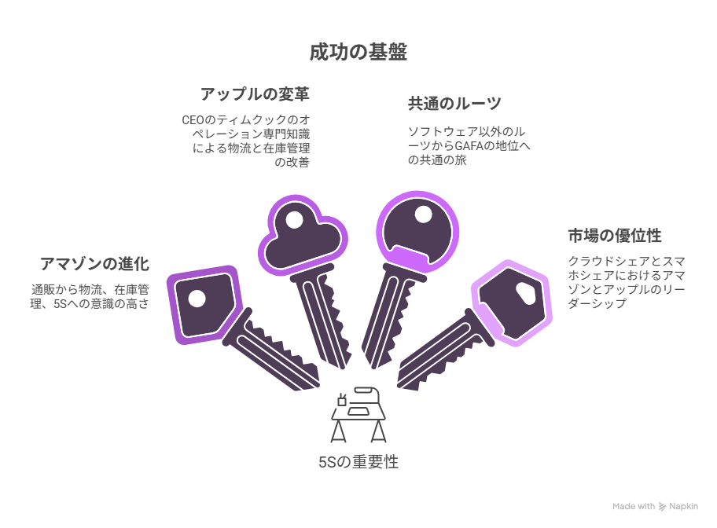

# 5S(整理・整頓・清掃・清潔・しつけ）

## 背景

5Sは主に製造業で利用される用語であり、安全衛生管理の基本となっている。  
その適用範囲は広く、在庫管理などの物流の分野でも展開され、  
ミスの防止などにも役立っている。ソフトウエアにバグはつきものです。  
ソフトウエアの**品質を高める手段として5Sの概念を採用します。**

### 関連リンク

- [5Sとは](https://www.smartmat.io/column/fives)

## 5Sで学ぶプログラミング品質向上ガイドと静的解析ツール

**〜 美しいコードは、美しい現場から生まれる 〜**  
  
### 1. はじめに：なぜ「コードに5S」が必要なのか？

製造業や建設現場で徹底されている5Sは、物理的な安全だけでなく、作業効率と品質を最大化するための知恵です。  
ソフトウェア開発における「コード」も、放っておけば散らかり、汚れ、やがて誰も手を付けられない「技術的負債」という名のゴミの山になってしまいます。  
私たちは静的解析ツールという「自動清掃ロボット」を使いこなし、常にプロフェッショナルな作業場（ソースコード）を維持する必要があります。  

### 2. 5Sとプログラミングの対応表

| 5Sの要素 | ソフトウェア開発での定義 | 具体的なアクション | チームへのメリット |
| :--- | :--- | :--- | :--- |
| **整理 (Seiri)** | 不要なコードの削除 | 未使用変数・デッドコードの廃棄 | コード理解のスピード向上、メンテナンスコストの削減。 |
| **整頓 (Seiton)** | ルールの統一・可読性 | 命名規則・インデント・フォルダ構成の標準化 | レビュー効率の向上、チーム内での「書き方」論争の解消。 |
| **清掃 (Seiso)** | 潜在的バグの点検 | 脆弱性や実行時エラーの原因（Null等）の排除 | 障害発生率の低下、システムの安全性・信頼性の向上。 |
| **清潔 (Seiketsu)** | 状態の維持（仕組み化） | CI/CDへの静的解析ツールの組み込み | 品質の属人化を排除し、常に高い水準で品質が安定する。 |
| **しつけ (Shitsuke)** | 習慣化・マインドセット | 警告を無視しない、コードレビューの徹底 | 技術力の底上げ、プロ意識の向上、誇りを持てるコードの構築。 |

### 3. 各ステップの詳細解説

#### 整理：必要なもの以外は「捨てる」

現場に不要な資材があると足元が危ないのと同様に、使われていないコードは混乱の元です。  
「いつか使うかも」は、コードを複雑にする最大の敵です。Gitなどのバージョン管理があるのだから、今は不要なものは潔く消しましょう。
  
ツールの役割: **未使用のメソッドや変数を検知し、削除を促します。**  

#### 整頓 ：誰でも「迷わず」読み書きできる

工具が決められた場所に置かれているように、コードも予測可能なルールで配置されるべきです。  
「自分が書いたコードを、3ヶ月後の自分が読んでもすぐ理解できるか？」を問いかけます。  

ツールの役割: **命名規則の違反をチェックします。誰が書いても名前に統一感があり、名前の意味に迷うことがありません。**  

#### 清掃 ：細部の「汚れ（バグの種）」を見逃さない

床の油汚れが事故に繋がるように、コードの些細な「不吉な臭い」がシステムダウンを招きます。  
清掃は単に綺麗にするだけでなく「点検」です。静的解析で出る警告は、未来の事故を防ぐための「小さな悲鳴」だと認識しましょう。  

ツールの役割: **セキュリティの脆弱性や、リソースリーク（メモリ漏れ）などの隠れた瑕疵を見つけます。**

#### 清潔：綺麗な状態を「標準」にする

一度掃除しても、三日坊主では意味がありません。常に綺麗な状態が保たれる「仕組み」を作ります。  
「個人の努力」に頼らず、「通らなければリリースできない」というガードレール（CI/CD）を設けることが、チームを守ることに繋がります。  

ツールの役割: **規定の品質スコアを満たさないコードは、マージ（統合）させない仕組みを構築します。**

#### しつけ：「プロ意識」を磨く

最後は、ルールを当たり前として守る「文化」です。  
ツールは敵ではなく、あなたの成長を助けるコーチです。指摘を真摯に受け止め、なぜそれが悪いのかを学ぶ姿勢こそが、プロのエンジニアへの近道です。  

### 4. 静的解析ツールを導入する真のメリット

静的解析ツールを使うことは、**24時間365日、文句を言わずにコードを監視・清掃してくれるプロの守衛**を雇うのと同じです。  

- レビューコストの削減: 些細な書き方の修正はツールに任せ、人間は「ロジック」や「価値」の議論に集中できます。
- 新人の早期戦力化: ツールが修正箇所を教えてくれるため、学びながら正しいコーディングを身につけることができます。
- 安心感の醸成: 「ツールが通っているから、少なくとも最低限の品質は保証されている」という自信を持って開発に臨めます。

### 5. まとめ

5Sは「掃除」が目的ではなく、**良い仕事を効率的に行うための土台**です。 静的解析ツールを使いこなし、常にクリーンなコードを保つことは、あなた自身の、そしてチーム全体の価値を高めることに直結します。  

今日からできること： 自分の書いたコードに、静的解析ツールの「Warning（警告）」が出ていないか確認してみましょう。一つ消すごとに、あなたの作業場は一歩、美しくなります。  

### 関連リンク

- [多くのコードはなぜ複雑化するのか？―設計を学ぶことの本当の価値](https://note.com/kakup/n/nb05b012213c8)
- [【SOLID原則の入口】きれいなコードで生まれるメリットとその書き方](https://www.divx.co.jp/media/173)
- [脳に収まるコードの書き方](https://www.exa-corp.co.jp/column/book60.html)

## ミス防止

プログラマーもミスをします。他業界のミスをなくすしかけ・改善には参考になる点がたくさんあります。  
下記資料が良い参考になります。  
  
[仕事のミスをなくす５０のしかけ改善](../13_Ref/00_Policy/00_Policy_04_5S_udm_MissPrevention_1.pdf)1

### 関連リンク

- [プログラマーのケアレスミスが減らない原因と対策5選](https://ikuhon.com/entry/programmer-careless-mistakes-5-solutions)
- [ジェイコム株大量誤発注事件](https://ja.wikipedia.org/wiki/%E3%82%B8%E3%82%A7%E3%82%A4%E3%82%B3%E3%83%A0%E6%A0%AA%E5%A4%A7%E9%87%8F%E8%AA%A4%E7%99%BA%E6%B3%A8%E4%BA%8B%E4%BB%B6)

## 5S観点でのIT業界事例

アップルとアマゾンのケースです。  
トヨタも含めて**5Sを知るものが覇権を握っています。**

### アップルとアマゾンの共通点

アップル：CEOのティムクック→オペレーションが専門→物流・在庫管理→5S  
アマゾン：通販→物流→在庫管理→5S  
  
ティムクックとアマゾンは共に、ITが本業でなかった点が共通点。  
しかし共にGAFAと呼ばれる中に入り、さらに  
  
アマゾン:クラウドシェア世界No1  
アップル：日本のスマホのシェアNo1  
となっている。
  

### 関連リンク

- [アップルにおけるサプライチェーンの進化](https://scsr.jp/document/20190527_SCSR_takeuchi.pdf)
- [アップルが復活させた影の主役は在庫管理](https://shikumika.com/column/%E5%9C%A8%E5%BA%AB%E7%AE%A1%E7%90%86%E3%81%A8%E3%82%A2%E3%83%83%E3%83%97%E3%83%AB%E7%A4%BE/)

## 引用文献

> 1. 松井 順一. 仕事のミスをなくす５０のしかけ改善 [Online course]. Udemy; 2024 [cited 2025 Oct 3]. Available from: https://www.udemy.com/course/web_marketing_laws/
