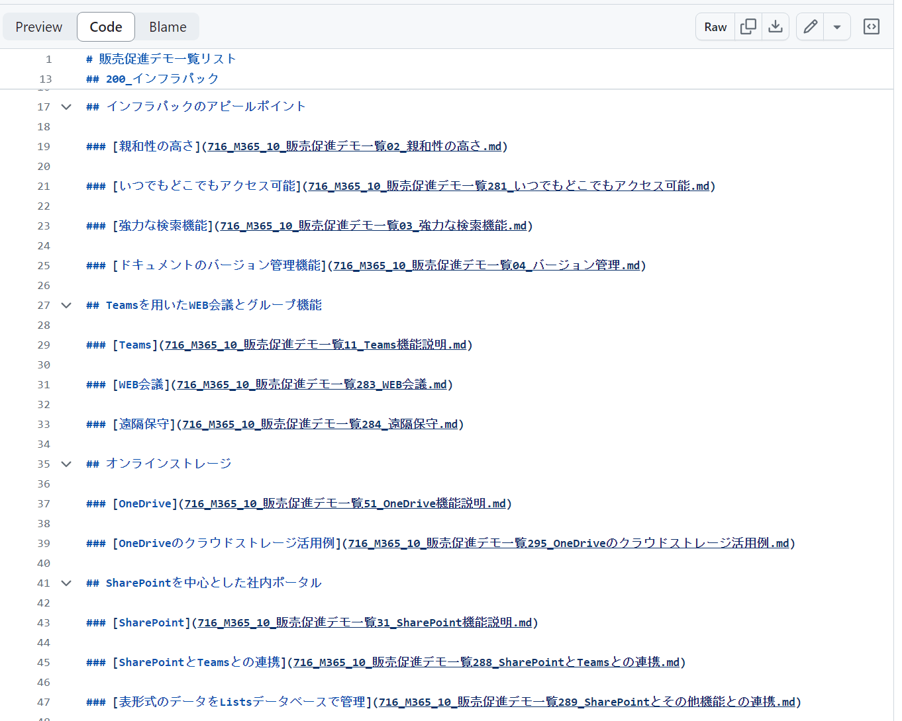
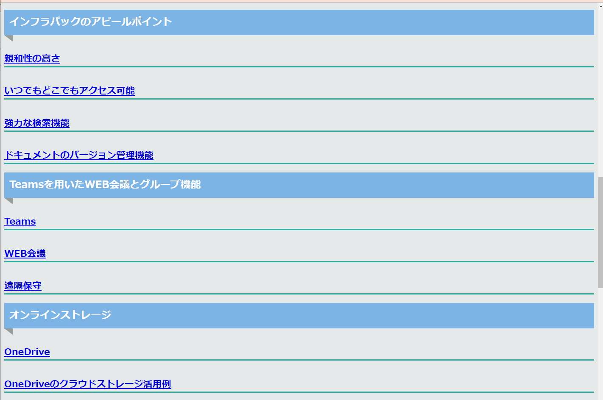
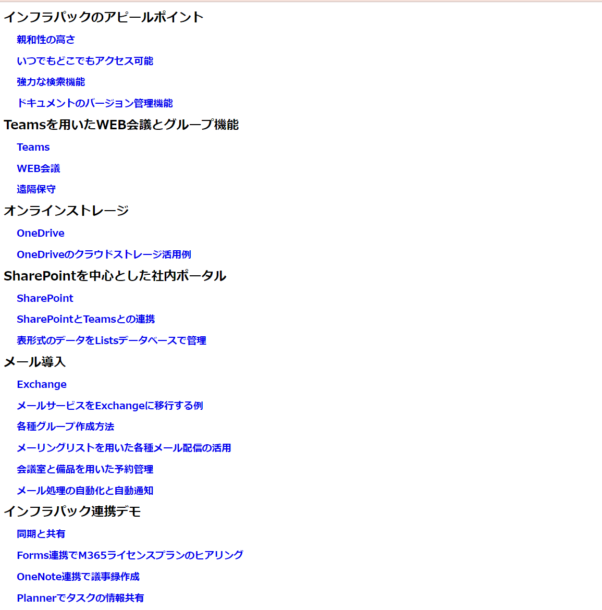

# マークダウンとGitHubを活用したドキュメント作成支援サービス

## はじめに

社内文書やマニュアルなどを効率的に管理でき、コストダウンも可能な手法を提案します。  

## 提供するサービス

| サービス名 | 詳細 |
| --- | --- |
| GitHub導入支援 | GitHubの導入から運用までをサポートし、プロジェクト管理の効率化を実現します。 |
| GUIツール導入支援 | 直感的に操作できるGUIツールの選定と導入を支援します。 |
| オープンソースツール導入支援 | コスト削減と柔軟なカスタマイズが可能なオープンソースツールの導入をサポートします。 |
| ライティングツール導入支援 | 効率的な文章作成を支援するライティングツールの導入をサポートします。 |
| マークダウンからHTML出力 | マークダウン形式のドキュメントをHTMLに変換し、ウェブ上での公開を容易にします。 |
| マークダウンからPDF, Word出力 | マークダウンをPDFやWordに変換し、ビジネス文書として利用可能にします。 |
| マークダウン作成補助ツール | 以下のツールを提供し、マークダウン作成を支援します。 - エクセルの関数を用いたマークダウン構文の自動生成 - エクセルのマクロを用いたマークダウン対応の表の自動生成 |
| Webスクレイピングツールとマークダウンとの連携 | Webスクレイピングツールとマークダウンを連携し、情報収集とドキュメント作成を自動化します。 |
| 文章校閲機能とマークダウンとの連携 | 文章校閲機能をマークダウンと連携させ、ドキュメントの質を向上させます。 |

## メリット

| メリット | 詳細 |
| --- | --- |
| **無料** | マークダウン自体は無料で利用可能です。 |
| **マルチプラットフォーム対応** | Windows、Mac、Linuxなど、さまざまな環境で使用できます。 |
| **簡単な文法** | マークダウンはHTMLよりも簡単な文法で記述できます。 |
| **一元管理** | さまざまな形式のデータを一元管理できます。 |
| **他のフォーマットへの変換が容易** | PDFやWordなどへの変換が簡単に行えます。 |
| **業務効率化** | RPAや自動化ツールとの連携が可能で、業務の効率化を実現します。 |
| **バージョン管理との相性が良い** | テキスト形式なので、Gitなどのバージョン管理ツールと相性が良く、変更履歴の管理が容易です。 |
| **検索・変更が簡単** | プレーンテキスト形式なので、正規表現を利用した検索・変更が簡単に行えます。 |
| **VS Codeの利用** | VS Codeを利用することで、GitHubとの連携やドキュメント作成が一つのアプリケーションで完結できます。 |
| **AIの利用** | ChatGPTなどのAIツールの入力・出力フォーマットとしてマークダウンをそのまま利用できます。 |
| **レイアウト修正コストの削減** | HTMLやCSSのメリットを活かし、レイアウトの修正コストを削減できます。 |

## 紹介事例

マークダウンとGitHubを活用した具体的な事例として、以下をご覧ください。
- [クックパッドのMarkdownとGitHubを用いた社内規定ドキュメントの導入事例](https://techlife.cookpad.com/entry/2019/06/26/182322)

## サービスの差別化と課題解決

### 差別化が可能な点

当社のサービスは、GitHubとマークダウンを活用している点で他社と差別化を図っています。特に、エクセルの関数やマクロを用いたマークダウン構文の自動生成ツールや、Webスクレイピングツールとの連携など、独自のソリューションを提供しています。

#### GitHubからマークダウン文章を閲覧

GitHub上でマークダウンを自動的に見やすく整形するため、
位置ずれの微修正といったレイアウトの修正の手間が必要なく、ドキュメント作成工数の削減に大きく寄与します。
また誰が作成しても、統一したレイアウト構成で表現できます。

#### いつでもどこでもアクセス制限のある閲覧が可能

GitHubはクラウドサービスでもあるため、いつでもどこでもアクセス可能です。
また無料版のサービスの利用も可能です。
アクセス制御といったセキュリティ面にも柔軟な対応が可能です。

#### 変更管理機能

Gitの変更管理機能が利用でき、手作業でのバックアップ作業なしでも運用が可能です。

#### 柔軟な表示レイアウト機能

CSSを用いることで表示表現を自由に変更することができます。
また社内サーバーやGoogleChrome、Notionなど連携できるアプリケーションも多く、柔軟な運用が可能です。

#### 文章校閲機能との連携

文章校閲に必要な共有情報をGitHubを用いて共有活用することが可能となります。
結果、メンバの意思疎通とドキュメント品質の改善が進みます。

#### 高度な検索機能

サクラエディタ（無償）や秀丸エディタ（有償）ツールを用いて正規表現などの高度な検索が可能です。
また秀丸マクロを利用した、修正を全ファイルに一括反映する機能などもサポートします。

#### マークダウンから他形式のドキュメントへの変換

- HTML変換:ホームページへの転用
- WORD変換:文章校閲機能
- PDF変換:全文検索

### 実例紹介

#### 表示サンプル紹介

GitHubからマークダウンのコードを表示しています。  

GitHubからマークダウンで作成したコードを元にユーザーにわかりやすく整形して自動表示しています。  

Google Chromeから表示しているケースです。  

Google ChromeからCSSを指定して表示フォーマットを変更しているケースです。  

  
  
  

#### マークダウンからHTMLへと変換した例

下記のGitHub上にマークダウン変換元を確認することができます。

- [GitHubに公開した紹介例](https://github.com/trustIT2023/bPc_M365/blob/main/1_Doc/11_Mdn/716_M365_00_DemoList.md)

上記のGitHub上に公開したマークダウン文章からHTMLに変換した例として、以下のページをご参照ください。

- [ホームページに公開した紹介例](https://examplemicrosoft365.trust-it.jp/)

### 課題解決が可能な点

多くの企業が直面するドキュメント管理や作成の手間を軽減することが可能です。GitHubを利用することで、バージョン管理や共同編集がスムーズになり、業務効率が大幅に向上します。さらに、マークダウン形式を利用することで、シンプルな文法で美しいドキュメントを作成でき、他のフォーマットへの変換も容易です。

## アピールポイント

1. **無料で利用可能**: 基本的なサービスは無料で提供しているため、コストを気にせず導入できます。
2. **簡単な文法**: マークダウンは初心者でも簡単に学べる文法で、すぐに使いこなせます。
3. **業務効率化**: GitHubとの連携により、ドキュメントのバージョン管理や共同編集が容易になります。
4. **多様なツールとの連携**: エクセル、Webスクレイピング、文章校閲機能など、多くのツールと連携できるため、業務の幅が広がります。
5. **マルチプラットフォーム対応**: さまざまなOSやデバイスで利用できるため、場所を選ばず作業が可能です。

## まとめ

当社のサービスは、GitHubとマークダウンを活用したドキュメント作成を支援し、業務効率化と品質向上を実現します。無料で利用でき、多くのプラットフォームで動作するため、幅広いユーザーに対応可能です。興味を持たれた方は、ぜひ一度ご相談ください。

---

**注意**: 本記事の内容は予告なく変更されることがあります。
