# マークダウンGitHubの運用方針

## 運用方針

最初に表示される「目次」にリンクを張り、目次からすべてのマークダウンへのリンクをたどることが可能な構成をつくること。

### ファイル参照方法

#### リンクをクリックして直接参照するタイプ

PDFファイルなどの形式で保存しているものが対象。

#### 一旦ダウンロードしてから参照するタイプ

ウイルス感染するリスクがあるもの（例：エクセルのマクロファイルなど）は、  
セキュリティ上の観点から、直接起動して参照する利用方法を許容していません。  

---

## 各種参照方法

自分のスタイルにあった方法を選択してよい。

- GitHubから取得して、拡張設定をしたブラウザアプリ(chrome）で参照すること。(おすすめ）
  - 参照速度はおそらくこれが一番です。  
  - 拡張機能にも複数の選択肢があります。  
  - 文法の細部において、表記面でGitHubとの差異があります。
- GitHubにアクセスしてWEB上から参照すること。(PC、タブレット、スマホどこからでもアクセス可能。）
- GitHubからGit経由で取得して、VS Codeで参照すること。(開発者向け）

---

## GitHubでマニュアルを見る方法

マニュアルは、Webブラウザ（インターネットを見るソフト）で見ることができます。
見るための操作方法を紹介します。

---

### 見たいマニュアルを探すとき（目次一覧）

マニュアルには、すべての項目の入り口となる「目次一覧（トップページ）」があります。
まずはこの画面から、知りたい内容のリンクをクリックして中身を見てみましょう。

青色の文字をクリックすると、その項目の詳細ページに移動します。

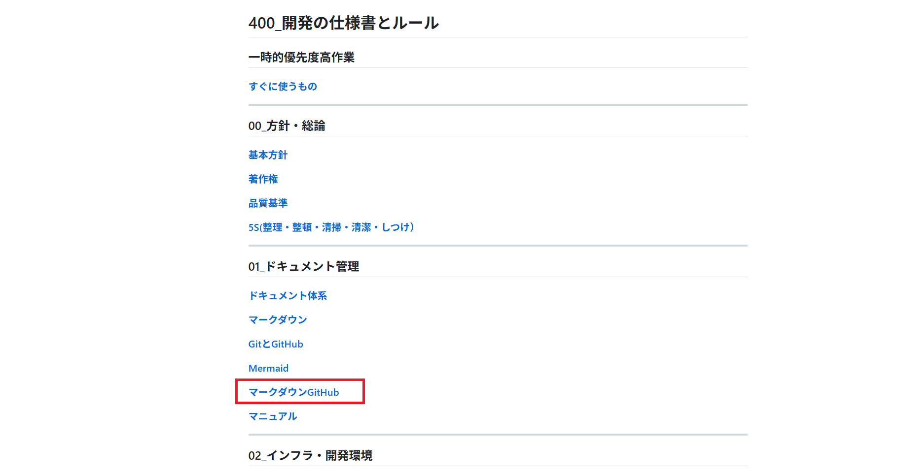

移動したページの中にも、さらに細かい「ページ内の目次」が用意されています。
ここから、さらに読みたい項目を選んでジャンプすることができます。

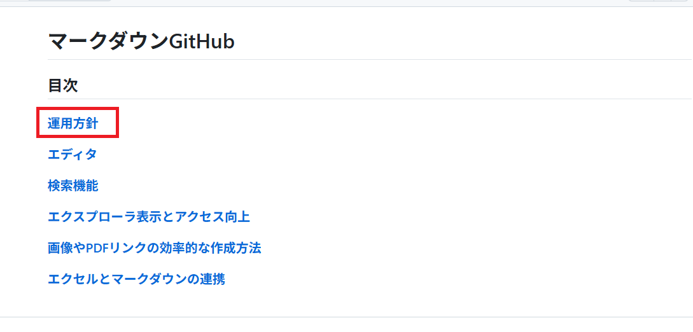

ここからマニュアルを閲覧することができます。

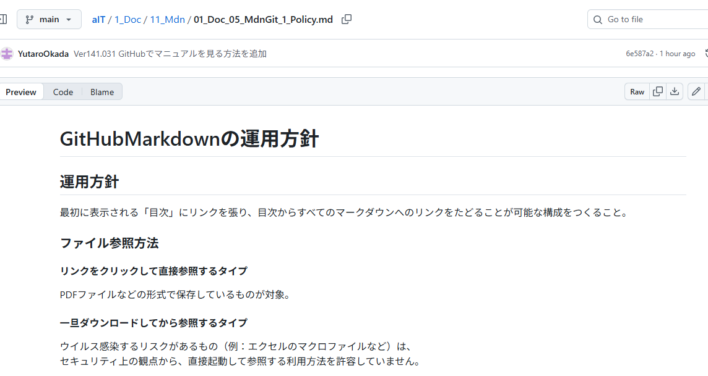

---

### 前のページに戻りたいとき（← →）

「さっき見ていたページに戻りたい」というときは、画面の **左上** にある矢印ボタンを使います。

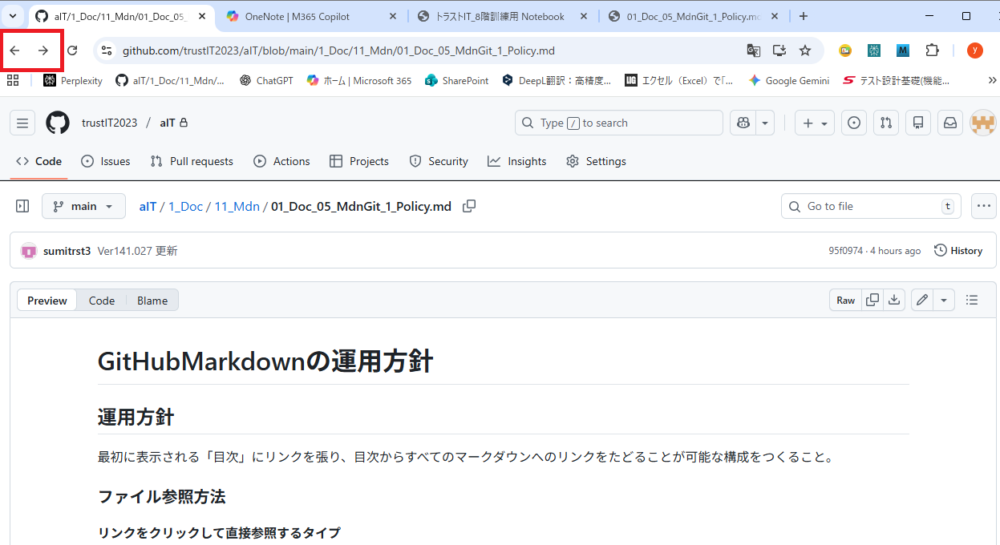

- **← (左の矢印)**： 一つ前のページに戻ります。
- **→ (右の矢印)**： 戻りすぎたときに、元のページに進みます。

---

### 別のマニュアルを選び直したいとき（現在地）

「今見ているものとは別のマニュアルを見たい」「一覧画面に戻りたい」というときは、タイトルの上にある **文字の列** を見てください。

ここには、「今見ているページ」が「どこの場所（グループ）」にあるかが表示されています。

画像の例を見てみましょう。一番右にあるのが、今見ているページの名前です。
その左側につながっている **「aIT」 / 「1_Doc」 / 「11_Mdn」** というのが、このページが入っている場所の名前です。

例えば、 **「11_Mdn」** という文字をクリックすると、「11_Mdn」という場所に入っているページの一覧画面に戻ることができます。
別のマニュアルを探したいときは、これらの文字をクリックして一覧画面に戻ってください。

---

### 資料の続きが見たいとき（More Pages）

PDFなどの資料を表示したとき、ページ数が多すぎると途中で表示が止まっていることがあります。
資料の下の方に **「More Pages」** と書かれたボタンがあるか確認してください。

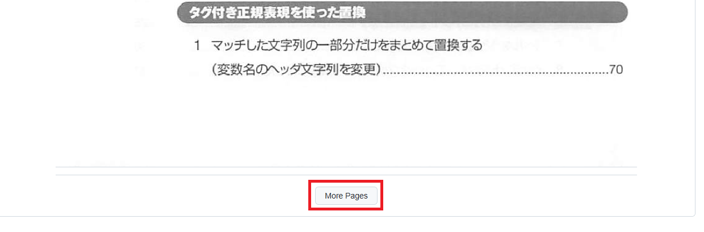

もしこのボタンがあったら、クリックしてください。隠れていた続きのページが表示されます。

---

### 効率よく目次の見出しにジャンプする、および目次一覧を参照する方法

読みたい項目が決まっているときは、画面の **右上** にある点と線が3つずつあるアイコンをクリックしてください。  

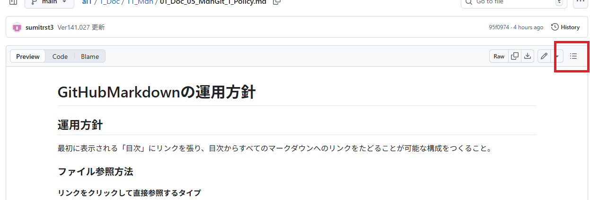

ボタンを押すと、以下のように右側に目次が出てきます。  

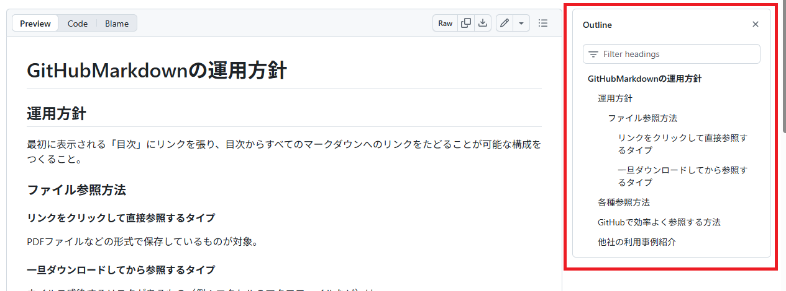

項目をクリックすると、その場所にジャンプします。  

---

### 資料をダウンロードして見るとき

GitHubでExcelやPowerPointを開こうとすると、中身が表示されずダウンロードを促されます。これは不具合ではなく、皆さんのアカウント情報を守るための重要なセキュリティ仕様です。

ブラウザで直接ファイルを開く仕組みは、悪意あるプログラムが勝手に実行される隙を与え、情報を盗まれるリスクがあります。GitHubはこうした被害を防ぐため、あえて表示を制限しています。一方、PCに保存してから開けば、ウイルス対策ソフトの保護下で安全に確認できます。

このひと手間は、自分自身と組織を守るための防護策です。安全性を確保した上で、以下の手順で**パソコンにファイルをダウンロード**することで、正しいレイアウトで見ることができます。

#### 手順

1. 既存のマニュアルから対象資料のリンク（例：「GensPark(スライド)」）をクリックする。

   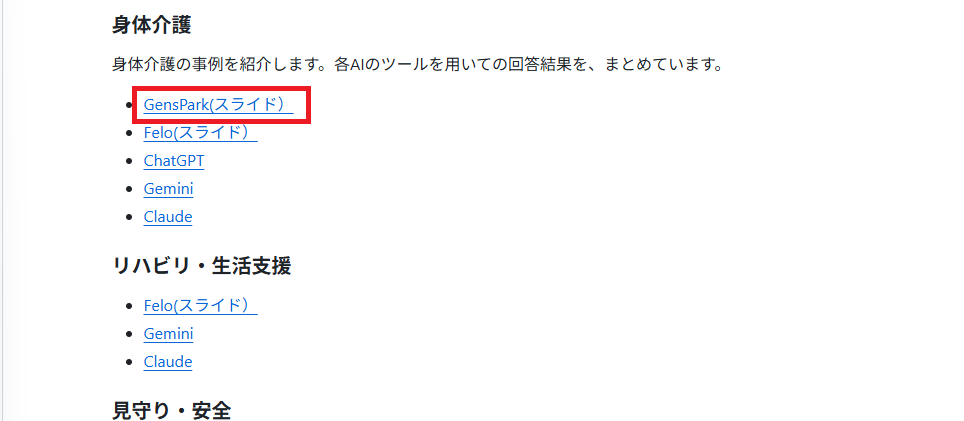

2. 以下画像のような画面が開いたら、右側のダウンロードアイコンをクリックしダウンロードする。
   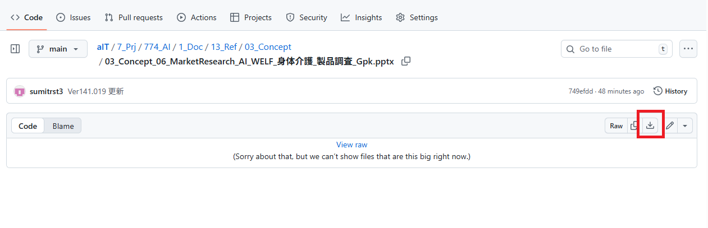

3. ダウンロードが完了したら、ブラウザ上部のダウンロードアイコンをクリックし（ダウンロードしたファイルが表示されていない場合）、ファイルをクリックして表示させる。

   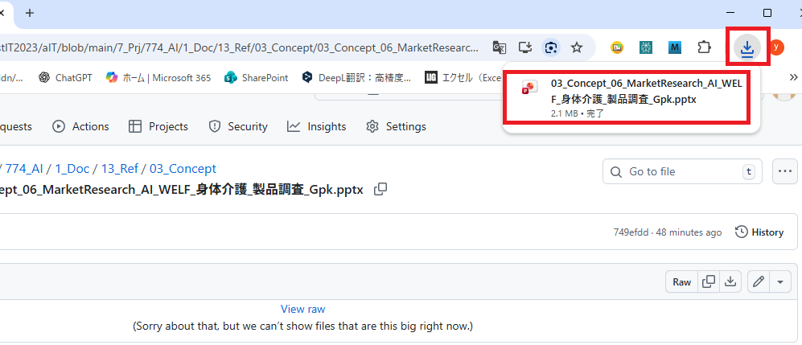

4. 以下画像のように正しく表示されれば成功です。

   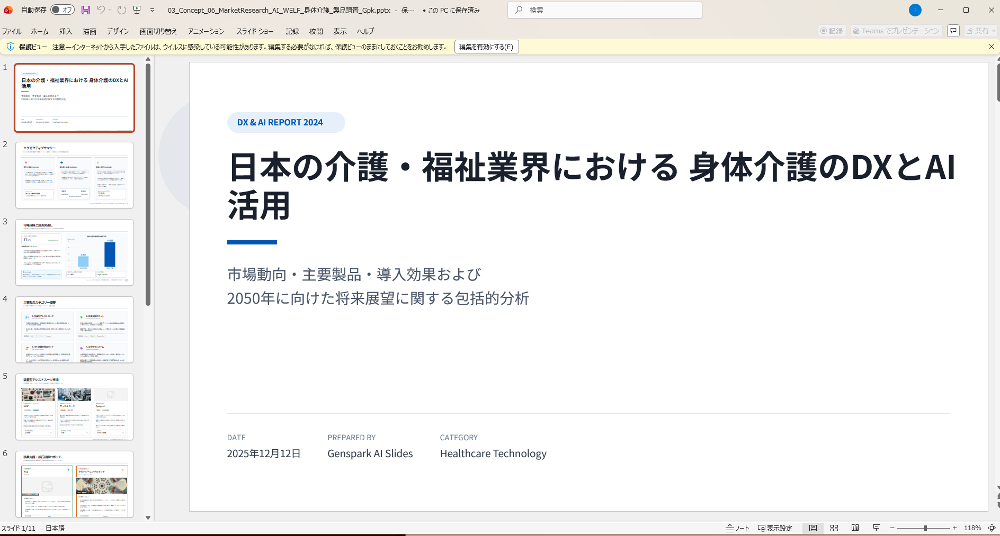

#### （うまくいかない場合）「ダウンロード」フォルダから探す方法

「ブラウザの操作を間違えて表示が消えてしまった」「どこをクリックすればいいかわからない」という場合は、**パソコンの「ダウンロード」フォルダ**を直接開くのが確実です。

1. パソコンの画面下のタスクバーなどにある **黄色いフォルダのアイコン（エクスプローラー）** を開きます。

   

2. 左側のメニューにある **「ダウンロード」** をクリックします。

   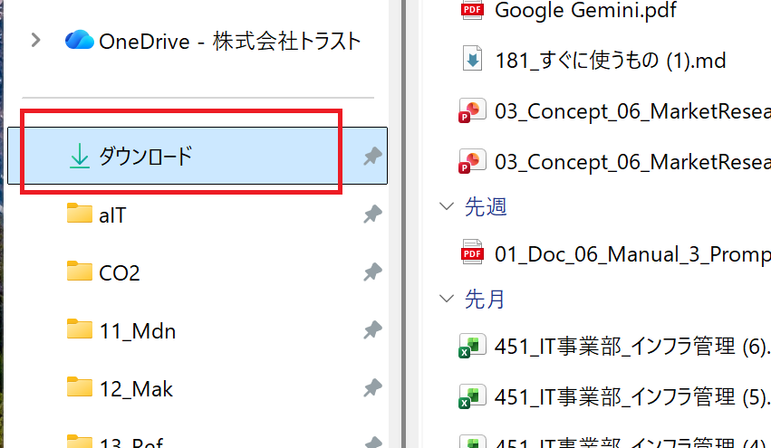

3. 一覧の中にダウンロードしたファイルが入っているので、ダブルクリックして開いてください。

   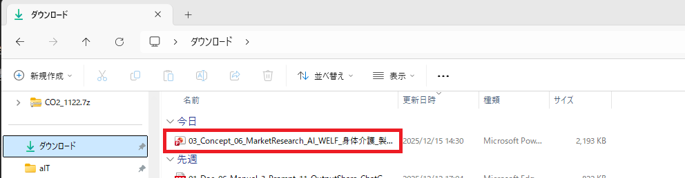

---

## 他社の利用事例紹介

> [!IMPORTANT]  
> **クックバッド社のMarkdownとGitHubを用いた導入事例**

- [社内規程を便利に管理](https://techlife.cookpad.com/entry/2019/06/26/182322)
