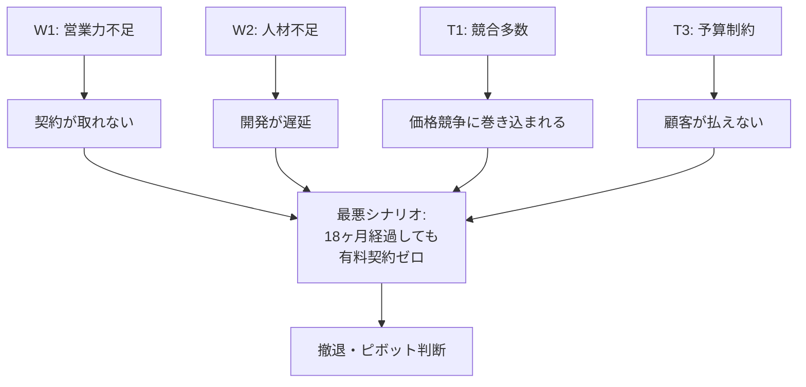
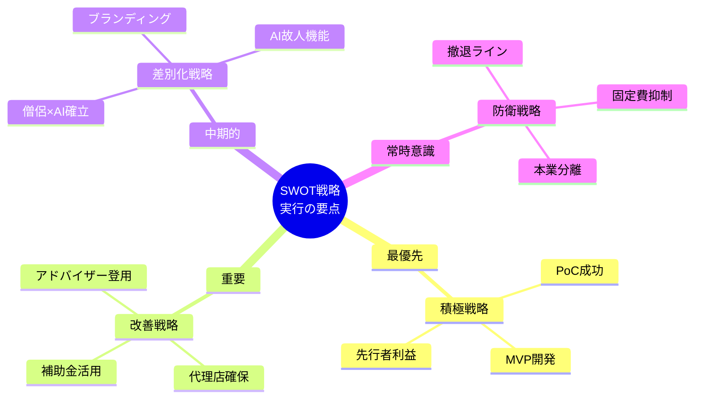

# 高齢者向け福祉サービス新規事業 SWOT分析および戦略提言

---

---

### 改善戦略（弱み × 機会）(Claude)

**戦略名**: パートナーシップによる弱点補完戦略

| 弱み | 機会 | 戦略アクション |
|------|------|----------------|
| W1: 営業力不足 | O1: 未開拓市場 | 代理店への高マージン（20-30%）で営業チャネルを確保 |
| W4: 福祉専門知識不足 | O5: 自治体DX予算 | PoC施設の介護士をアドバイザーとして登用 |
| W5: 補助金未経験 | O5: 自治体DX予算 | 補助金申請に強い行政書士・コンサルとの連携 |

**具体的アクション**:

1. **代理店開拓**: 介護用品卸、福祉機器販売店との提携（フック商材として提供）
2. **外部アドバイザー**: PoC施設の介護福祉士を月額顧問として契約
3. **補助金対応**: IT導入補助金、介護ロボット導入支援事業への申請準備

---

### 2.3 差別化戦略（強み × 脅威）(Claude)

**戦略名**: 「模倣困難な独自性」構築戦略

| 強み | 脅威 | 戦略アクション |
|------|------|----------------|
| S2: 僧侶の知見 | T1: 競合多数 | 「仏教的ケア × AI」は競合が真似できない独自領域 |
| S1: .NET MAUI | T2: 技術陳腐化 | Microsoft製品統一で長期サポートを確保 |
| S3: Azure融合性 | T5: 大手席巻 | 大手が狙わない「精神ケア × 低価格」ポジションを死守 |

**具体的アクション**:

1. **独自性の言語化**: 「温かみのあるテクノロジー」をブランドメッセージとして確立
2. **AI故人機能（将来）**: グリーフケア領域への拡張で、競合との差を決定的に
3. **Microsoft連携強化**: Azureパートナープログラムへの参加検討

---

### 2.4 撤退・防衛戦略（弱み × 脅威）(Claude)

**戦略名**: リスク分散・最悪回避戦略

| 弱み | 脅威 | 戦略アクション |
|------|------|----------------|
| W2: 人材不足 | T1: 競合多数 | 大手と同じ土俵で戦わない（ニッチ特化） |
| W1: 営業力不足 | T3: 予算制約 | 事例ベースの営業（PoC成功を最大活用） |
| 本業リスク | T4: 政治リスク | IT事業への段階的シフト（本業との連携なし） |

**具体的アクション**:

1. **撤退ライン設定**: 18ヶ月でPoC成功事例が出なければ、ピボットまたは撤退を検討
2. **本業分離**: 先物・排出権事業とIT事業の財務を完全分離
3. **固定費抑制**: ファブレス（製造なし）体制の維持、固定負債を抱えない

---

## リスクシナリオと対応策(ChatGPT)

### ■ リスク1：営業活動の停滞  
**対応策：代理店販売・紹介制度導入**

### ■ リスク2：AI品質不足  
**対応策：僧侶監修＋外部AIエンジニアレビュー**

### ■ リスク3：技術陳腐化  
**対応策：高速リリース＋MAUI特化で常に先手**

### ■ リスク4：福祉知識不足  
**対応策：福祉専門家との連携・PoCで現場知見収集**

### ■ リスク5：本業リスク（政策）  
**対応策：事業部の半独立化・別収益軸の確保**

---

### リスクシナリオと対応策(Claude)

#### 最悪シナリオの特定

#### リスクシナリオ一覧と対応策

| リスクシナリオ | 発生確率 | 影響度 | 対応策（予防） | 対応策（発生時） |
|----------------|----------|--------|----------------|------------------|
| **PoC施設が見つからない** | 低 | 高 | 個人的つながりを最大活用、複数候補を確保 | 無償トライアルで1施設を確保 |
| **開発が大幅遅延** | 中 | 高 | MVP機能を最小限に絞る、スコープ管理徹底 | 外部エンジニア（副業）の追加投入 |
| **競合が類似サービスをリリース** | 中 | 中 | 「僧侶×AI」の独自性を早期に確立 | 精神ケア領域に特化し、差別化を明確に |
| **代理店が獲得できない** | 中 | 中 | 高マージン（20-30%）で魅力度UP | 直販に切り替え、展示会・セミナー営業 |
| **顧客が価格に納得しない** | 低 | 中 | 競合比20-30%安の価格設定 | フリーミアムモデルで導入障壁を下げる |
| **本業の急激な悪化** | 低 | 高 | IT事業の財務分離 | IT事業への完全シフトを前倒し |

#### 撤退・ピボット判断基準

| 判断時期 | 判断基準 | 判断内容 |
|----------|----------|----------|
| 6ヶ月時点 | PoC施設と契約できていない | ターゲット再検討（施設→家族直販など） |
| 12ヶ月時点 | PoC効果測定で有意な改善なし | 機能・UXの抜本的見直し |
| 18ヶ月時点 | 有料契約5件未満 | 撤退またはピボット（別領域への転用） |

---

## 6. まとめ：戦略実行の要点(Claude)

