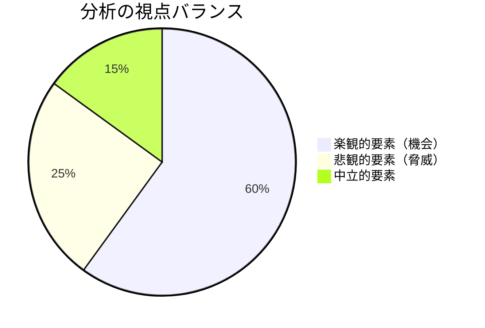
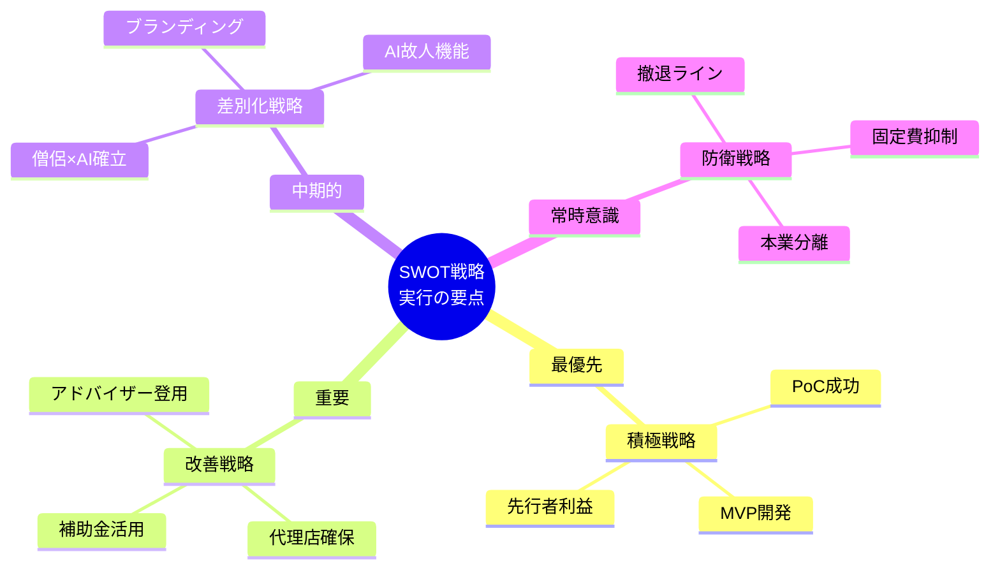
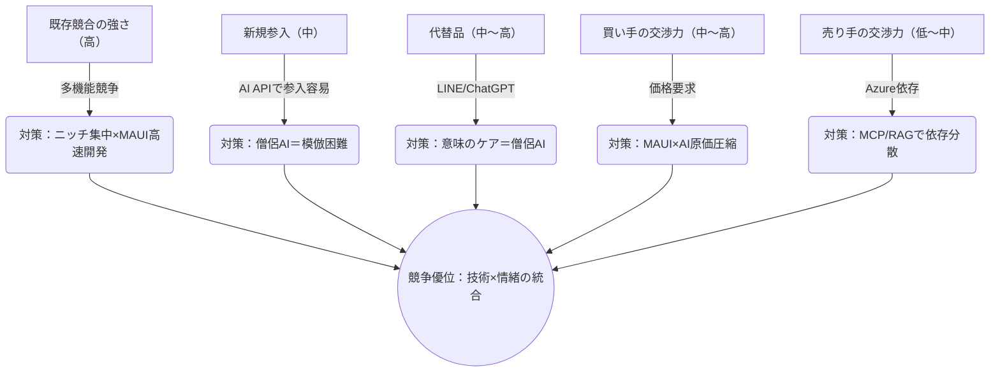
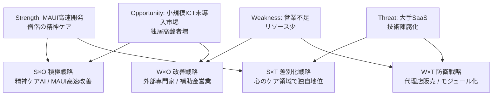
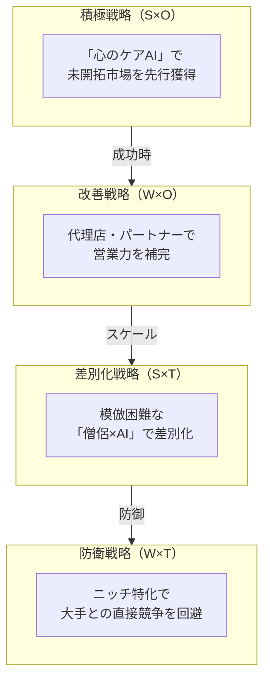
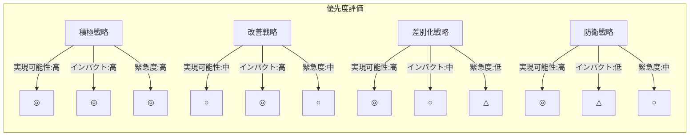

# 高齢者向け福祉サービス新規事業 外部環境分析と戦略提言

## サンプル例抜粋

### 円グラフ

#### 総評：分析のバランスチェック

**所見**: 提示された分析は「機会」に重点が置かれており、やや楽観的。以下の「批判的検証」で脅威への対応力を再評価する。

---

### 特性要因図

#### 重要成功要因（KSF）の特定

---

### フローチャート

#### 視覚的サマリー（5フォース図）

### クロスSWOTマップ

#### 戦略マップ概要

#### 戦略マップ評価

