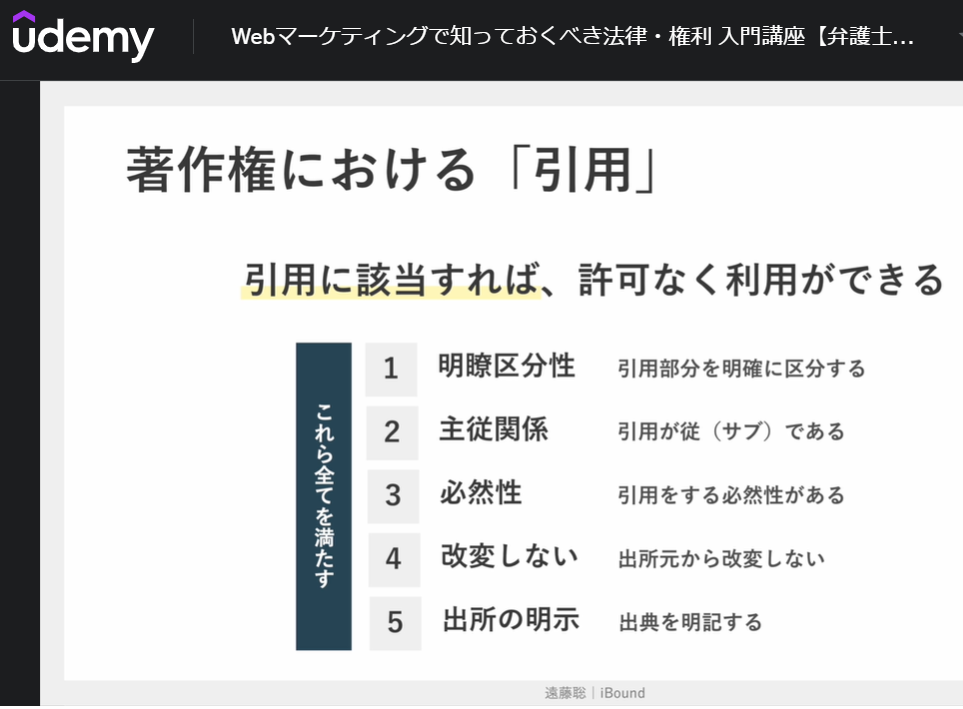
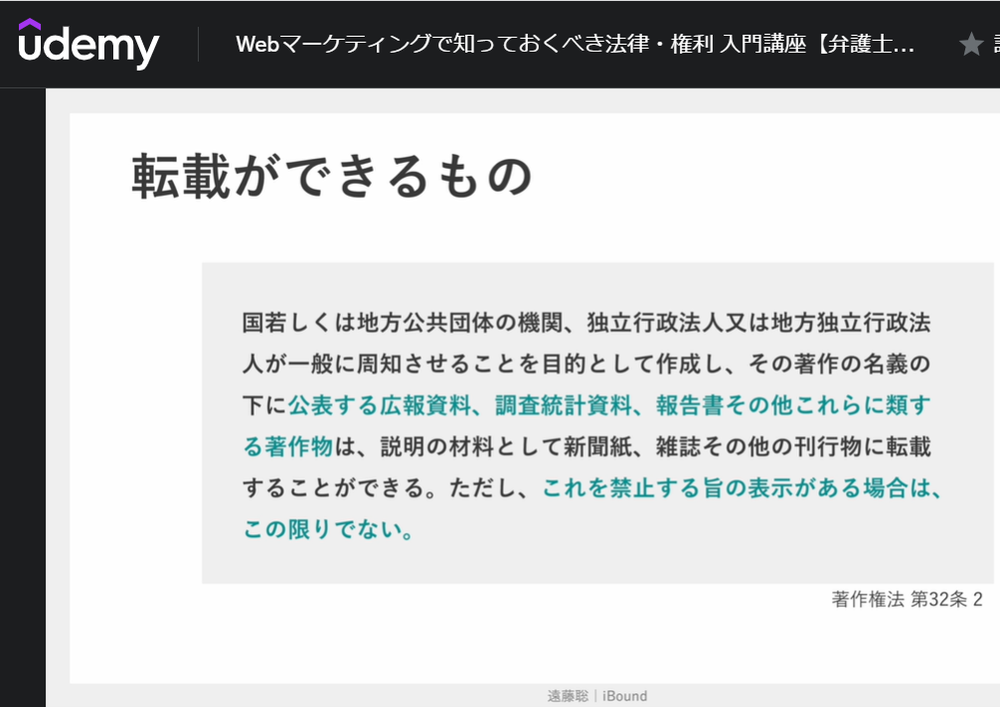
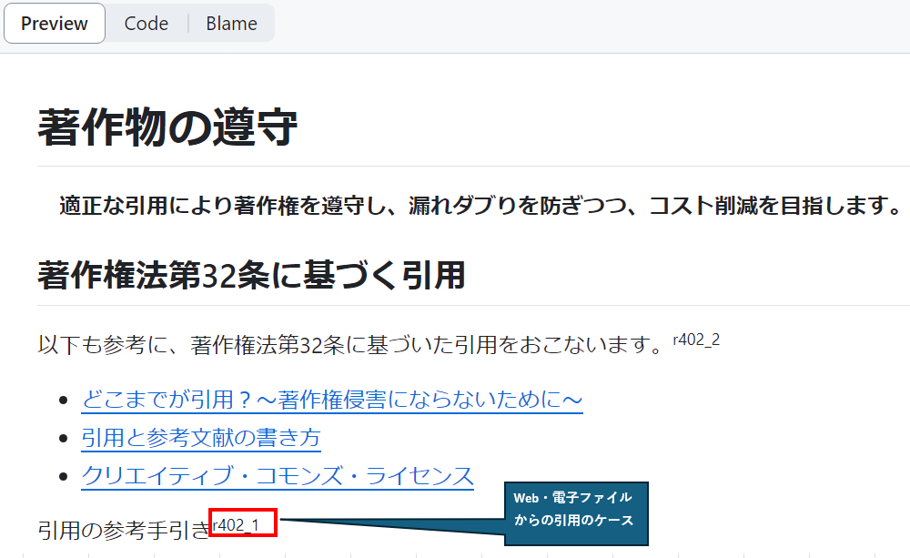
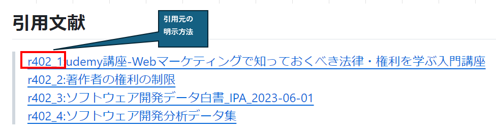

# 著作物の遵守

　**適正な引用により著作権を遵守し、漏れダブりを防ぎつつ、コスト削減を目指します。**  

## 著作権法第32条に基づく引用

以下も参考に、著作権法第32条に基づいた引用をおこないます。r402_2

- [どこまでが引用？～著作権侵害にならないために～](https://www.tokkyo.ai/tokkyo-wiki/copyright-infringement/)
- [引用と参考文献の書き方](https://www.clib.kindai.ac.jp/search/pdf/guide_quote.pdf)
- [クリエイティブ・コモンズ・ライセンス](https://creativecommons.jp/licenses/)

引用の参考手引きr402_1  

## 著作権法第32条に基づく転載

転載の参考手引きr402_1  

　**著作権の規制が緩やかな、IT系国家資格の主催団体でもある日本情報処理機構(IPA)の資料を積極的に活用します。**  

### IPAの公開資料

#### 開発手法

- [IPAユーザーのための要件定義ガイド](https://www.ipa.go.jp/publish/tn20191220.html)
- [統計指標に基づく品質マネジメント実践集トピックス概要_IPA_2023-06-01](https://www.ipa.go.jp/publish/wp-sd/index.html)  
- [ソフトウェア開発分析データ集2022_IPA_2023-06-01](https://www.ipa.go.jp/digital/chousa/metrics/metrics2022.html)  

#### 開発環境(IPA資料)

- [開発対象プラットフォーム](../13_Ref/402_ObservanceOfCopyrightedMaterial/r402_3_IPA_ソフトウェア開発データ白書2018-2019_000069381.pdf#page=47)r402_3
- [プラットフォーム(OS)](../13_Ref/402_ObservanceOfCopyrightedMaterial/r402_4_IPA_ソフトウェア開発分析データ集2022_000102171.pdf#page=15)r402_4
- [開発言語](../13_Ref/402_ObservanceOfCopyrightedMaterial/r402_3_IPA_ソフトウェア開発データ白書2018-2019_000069381.pdf#page=48)r402_3

#### ソフトウエアテスト(IPA資料)

- [IPA_ソフトウエアテスト見積もりガイドブック](https://www.ipa.go.jp/files/000005132.pdf)
- [IPA_ソフトウエアテスト見積もりガイドブック2](https://www.ipa.go.jp/files/000005133.pdf)

## OSS(オープンソースソフトウエア)

 OSSもライセンス規定を順守して、利用していくこと

- [OSSとは？意味や種類、商用利用ライセンスの定義を解説)](https://www.itmanage.co.jp/column/oss/#:~:text=OSS%EF%BC%88%E3%82%AA%E3%83%BC%E3%83%97%E3%83%B3%E3%82%BD%E3%83%BC%E3%82%B9%E3%82%BD%E3%83%95%E3%83%88%E3%82%A6%E3%82%A7%E3%82%A2%EF%BC%88Open,%E3%81%8C%E5%8F%82%E5%8A%A0%E3%81%97%E3%81%A6%E3%81%84%E3%81%BE%E3%81%99%E3%80%82)
- [OSS（オープンソースソフトウェア）とは？利用時のメリットと注意点](https://hnavi.co.jp/knowledge/blog/oss/)

## 引用方法の基本ルール

### マークダウンでの引用独自ルール

- 上付き文字で末尾の引用文献の参照箇所を示す方式を基本とし、命名規則は下記とする。
  - Web及び電子ファイルからの引用：先頭に「r」＋(3桁の数字)＋任意の番号および名称
  - 書籍からの引用：「参考図書」＋(3桁の数字)_＋任意の番号および名称
- 末尾に上記のルールで記載した番号に対する引用元を記入する。

#### 具体例

マークダウンの文章をGitHub上で表示しているときの例です。  

## 引用文献

> [r402_1:udemy講座-Webマーケティングで知っておくべき法律・権利を学ぶ入門講座](https://www.udemy.com/course/web_marketing_laws/?couponCode=ABCART0923)  
> [r402_2:著作者の権利の制限](https://www.bunka.go.jp/seisaku/chosakuken/seidokaisetsu/pdf/93736501_11.pdf)  
> [r402_3:ソフトウェア開発データ白書_IPA_2023-06-01](https://www.ipa.go.jp/publish/wp-sd/download.html)  
> [r402_4:ソフトウェア開発分析データ集](https://www.ipa.go.jp/digital/chousa/metrics/metrics2022.html)  

