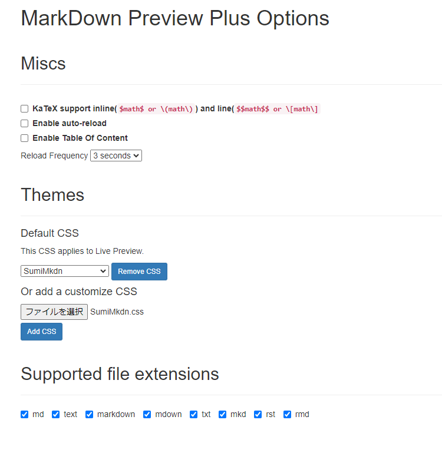

# マークダウン

## マークダウンとは

- [マークダウン記法とは？ マークダウンの書き方を網羅的に解説](https://backlog.com/ja/blog/how-to-write-markdown/)  
**マークアップ言語よりも容易で表記も自由な、変更にも強く自動ツールとの相性も良いマークダウン表記を採用すること**

## メリット

- **無料**
- GitHubやWEBブラウザなどさまざまなソフト、マルチプラットフォーム環境で使用可能。
- htmlより簡単な文法で表記が可能。
- さまざまな形式のデータを一元管理できること。
- 開発者視点での観点
  - 他のフォーマットへの変換も可能。PDFなど(移行が容易)
  - RPAや自動化などの業務効率化への転用も可能。
  - テキスト形式でバージョン管理ツールとの相性も良い。
  - プレーンテキストなので検索、変更が容易。正規表現も利用できること。
  - VS Codeの利用によりプログラミングやドキュメント作成がソフトの切替なしで可能。
  - ChatGPTなどのAIの入力、出力のフォーマットとしてそのままの利用が可能。
  - html,cssと同じメリットを活かすことができ、レイアウトの修正コストの削減が可能。

## 利用例

### 他社の利用事例紹介

> [!IMPORTANT]  
> **クックバッド社のMarkdownとGitHubを用いた導入事例**

- [社内規程を便利に管理](https://techlife.cookpad.com/entry/2019/06/26/182322)

### 他のフォーマットに自動変換可能

**文書作成のRPAとしての高い利用価値があります。**

- PDF
- HTML
- Word

## 文法

文法に関しては下記を参照  

- [Markdown 構文のクイック リファレンス](https://cloud.google.com/apigee/docs/api-platform/publish/portal/markdown-reference?hl=ja)
- [図解！Markdown記法の書き方を徹底解説](https://ai-inter1.com/markdown/)
- [覚えてしまえばすごく楽！Markdown記法を使ってみよう](https://un4navi.com/prologue/20079/)

## 便利な設定・拡張

### VS Codeとの連携

#### 全般

- [執筆をラクにするオススメ拡張機能10選](https://dotengineerblog.net/vscode-extensions-markdown-writing/)
- [Visual Studio CodeでMarkdownを書く環境を整える](https://qiita.com/84zume/items/1e6c720caba9898f5af2)

#### 設定

**[Visual Studio CodeのMarkdownプレビューにCSSを適用する](https://hachian.com/2020/08/17/vscode_markdown_css/)**

- [Markdown PreviewをCSSで読みやすくする方法 part2](https://habataki-blog.com/editor-vscode-markdown-css/)

- [VSCodeの設定用json_markdown_pdf](https://qiita.com/Soluna_Eureka/items/147de0a68d1026988b10)

#### 画像連携

- [Markdownでスクショ画像をペーストする](https://zenn.dev/ktechb/articles/968ff79f8f9c46a26ee5)
- [ペーストパス設定](https://tonari-it.com/vscode-markdown-paste-image-charactercount/)

### 自動変換

- [Markdownを素敵なHTMLに変換するツール3選](https://zatta.link/web/top3-tools-for-convert-markdown-to-html.html)

## Chromeを利用したローカル環境のプレビュー

- [様々なブラウザやテキストエディタでMarkDownを表示させる](https://qiita.com/C_HERO/items/194d477475f3a7f49a85)

### ChromeのCSS表示設定

- 
