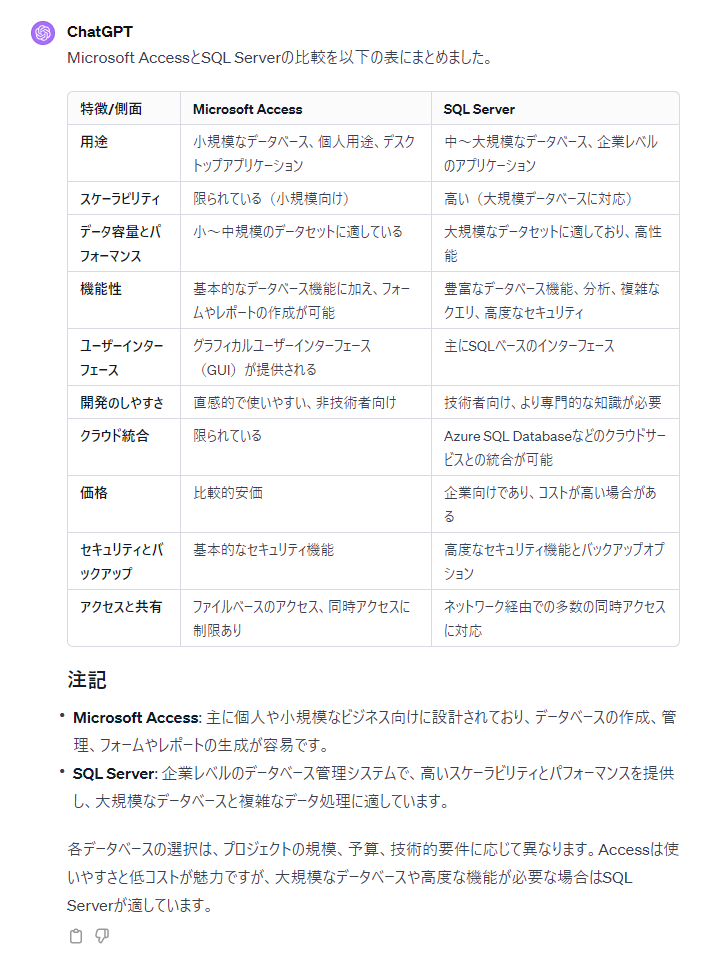
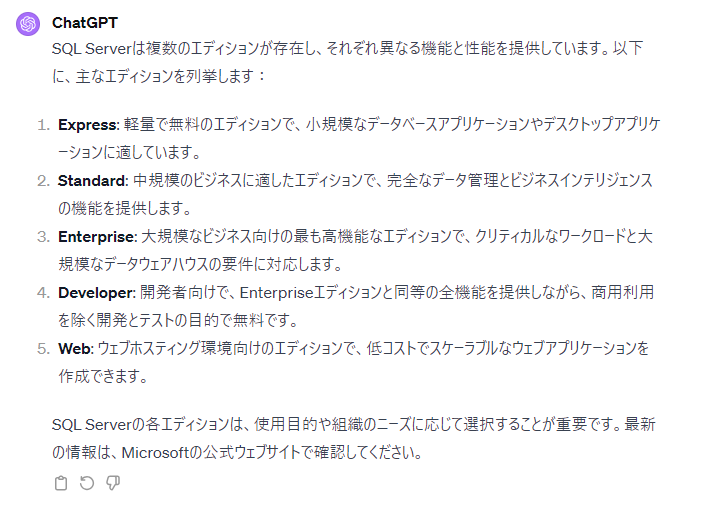
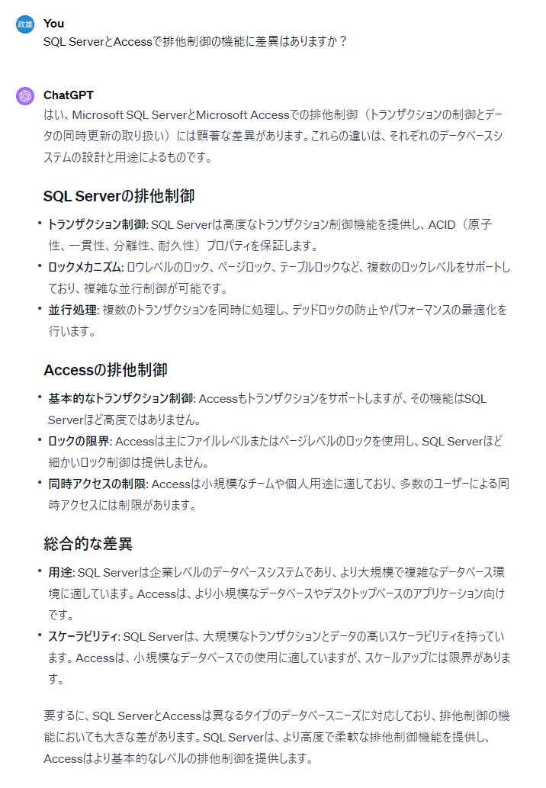
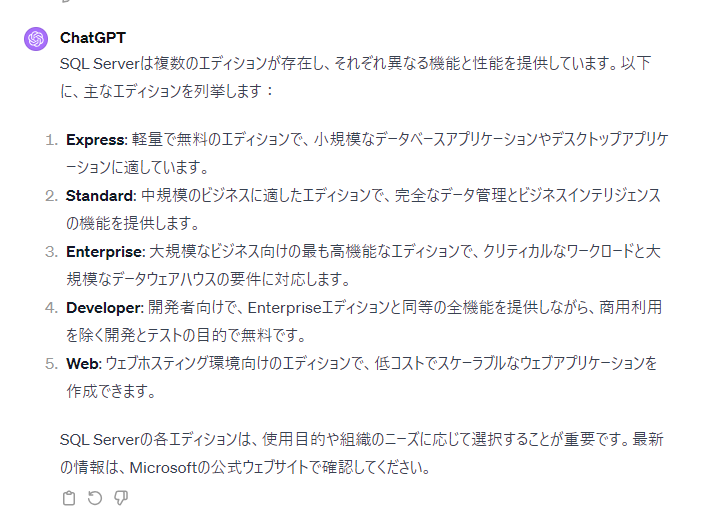

# DB技術選定までの流れ

> [!IMPORTANT]  
> **Windowsデスクトップアプリの場合はSQL Serverを選定する**

## SQL ServerとAccessの比較

## SQL ServerとMySQLの比較

Microsoft SQL ServerとMySQLの比較を以下の表にまとめました。

| 特徴/側面                | Microsoft SQL Server                                   | MySQL                                  |
|------------------------|-------------------------------------------------------|----------------------------------------|
| ライセンスとコスト      | 商用ライセンス（無料版のExpressも利用可能）                | オープンソース（GPL）; 商用版も利用可能  |
| プラットフォーム対応    | 主にWindows、Linux版も存在                                | クロスプラットフォーム（Windows, Linux, macOSなど） |
| パフォーマンス        | 高パフォーマンス、大規模トランザクションに適している          | 一般的なユースケースに対して高いパフォーマンス    |
| スケーラビリティ       | 中～大規模なアプリケーション向け                          | 小～中規模アプリケーション向け         |
| セキュリティ          | 高度なセキュリティ機能とデータ保護                           | 基本的なセキュリティ機能               |
| ユーザーベース        | 企業向け、プロフェッショナルな環境向け                       | 幅広いユーザーベース（とくにウェブアプリケーションで人気） |
| 開発のしやすさ        | ツールとエコシステムが充実（とくに.NET環境）                    | シンプルで使いやすい、広範なコミュニティサポート  |
| 機能性              | 豊富な機能セット（ビジネスインテリジェンス、分析など）         | 必要な基本的な機能を提供               |
| クラウド統合          | Azure SQL Databaseなどの統合が強い                        | AWS、Google Cloudなど多様なクラウドオプションに対応 |
| コミュニティとサポート | 強力なプロフェッショナルサポートとドキュメント              | 広範囲なオープンソースコミュニティとサポート    |

### 注記10

- Microsoft SQL Server: 企業レベルの機能とセキュリティを提供する商用データベースシステムです。とくにNETベースのアプリケーションやWindows環境での使用に適しています。

- MySQL: オープンソースで利用者が多いデータベースシステムです。とくにウェブアプリケーション開発に人気があり、使いやすく、拡張性が高いです。

これらのデータベースシステムはそれぞれが異なるニーズに応える特徴を持っており、プロジェクトの要件や予算、技術的な環境に応じて適切なものを選択することが重要です。

## 引用文献

> ChatGPT
