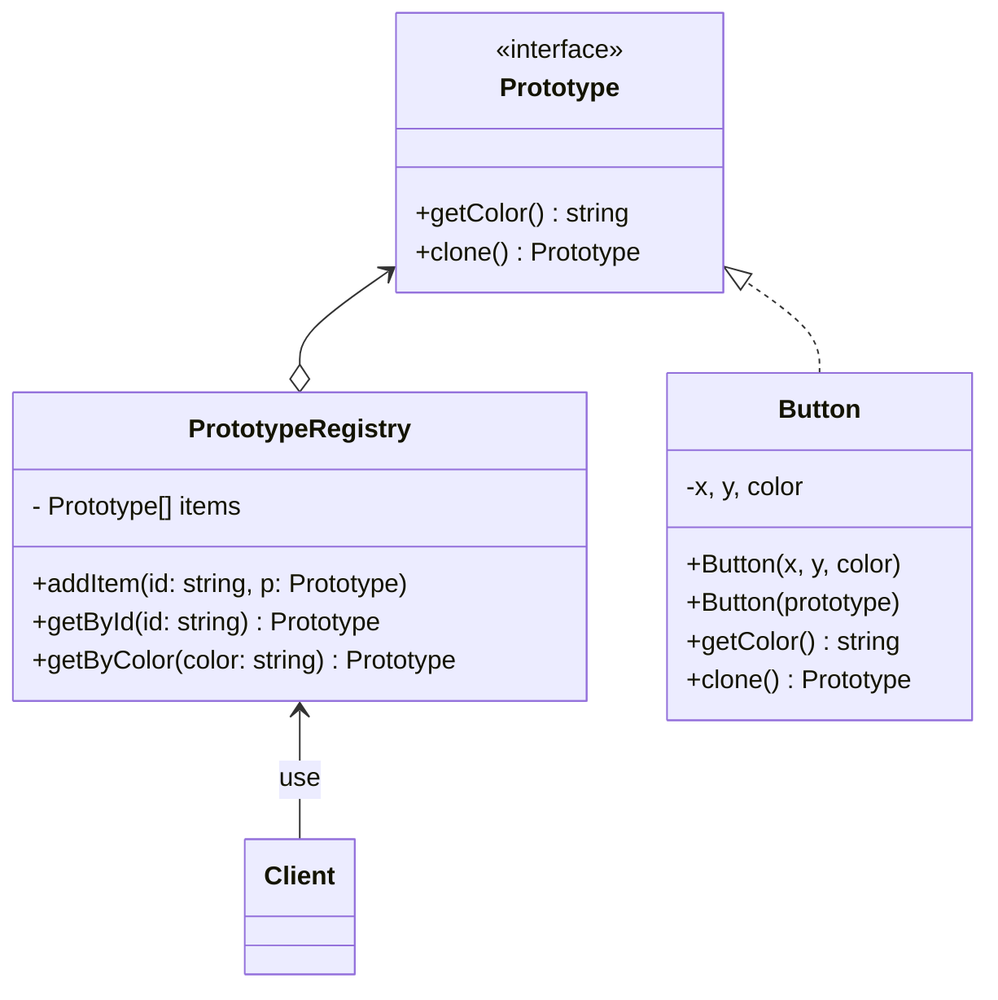

# PrototypeWithResister

```mermaid
classDiagram
    direction BT
    class PrototypeRegistry{
        - Prototype[] items
        +addItem(id: string, p: Prototype)
        +getById(id: string) Prototype
        +getByColor(color: string) Prototype
    }

    class Prototype{
        <<interface>>
        +getColor() string
        +clone() Prototype
    }

    class Button{
        -x, y, color
        +Button(x, y, color)
        +Button(prototype)
        +getColor() string
        +clone() Prototype
    }

    class Client

    PrototypeRegistry o--> Prototype
    Button ..|> Prototype
    
    Client --> PrototypeRegistry : use 
```

## 引用文献

[引用1](https://github.com/engineer-taro/mermaid_design_pattern)  
[引用2](https://refactoring.guru/design-patterns)  
