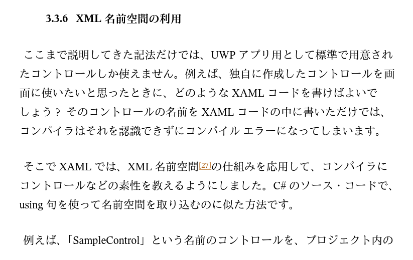
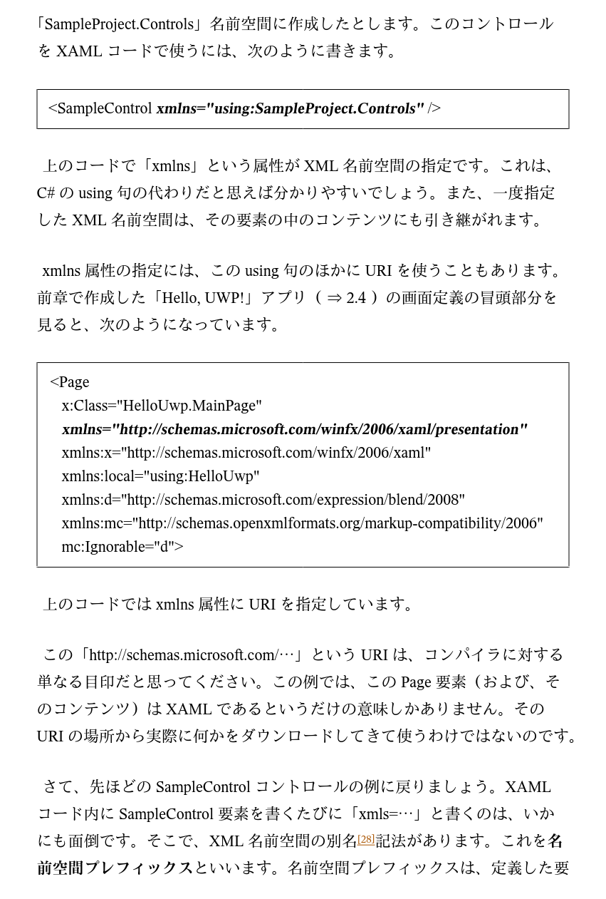
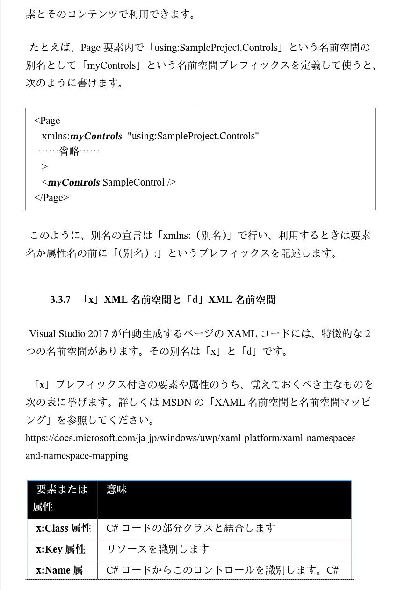
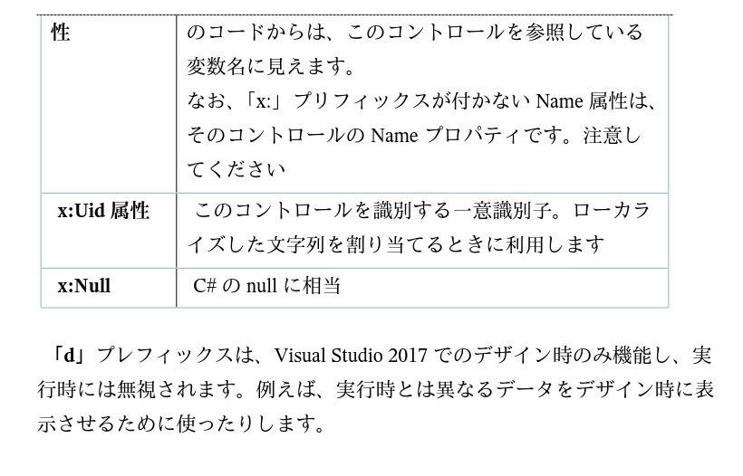

# XAML

## XAML構文

### XAMLの基本文法

- [基本的なXAML構文(Microsoft公式)](https://learn.microsoft.com/ja-jp/dotnet/maui/xaml/fundamentals/essential-syntax?view=net-maui-8.0)

#### Xamarin版のXAML

- [Xamarin公式XAMLページ全訳と基礎の入り口](https://qiita.com/toshi0607/items/241a7161491092d2a3e0)

#### WPF版のXAML

- [udemy_WPFの道XAMLに慣れる編](../14_Rcv/441_NETMAUI/udemy_WPFの道XAMLに慣れる編.pdf)
- [udemy_C#のWPFでXAMLを書く方法](https://www.udemy.com/course/wpf-xaml/learn/lecture/13515976#overview)

### 名前空間の定義

- [名前空間の表現](https://biotech-lab.org/articles/8442)

#### 名前空間の説明抜粋

### マークアップ拡張

- [マークアップ拡張(Microsoft公式)](https://learn.microsoft.com/ja-jp/previous-versions/xamarin/xamarin-forms/xaml/xaml-basics/xaml-markup-extensions)

### App.xaml

- [.NET MAUI App.xaml の役割と設定方法](https://prosen.net/programming-dotnet-maui-what-is-app-xaml/)

### 各コントロール

#### 各種レイアウト

- [StackLayout(Microsoft公式)](https://learn.microsoft.com/ja-jp/dotnet/maui/user-interface/layouts/stacklayout?view=net-maui-8.0)

#### ボタン

- [ボタンプロパティ詳細](https://prosen.net/programming-dotnet-maui-xaml-ui-button/)
- [ボタンの表示状態の参考情報1](https://learn.microsoft.com/ja-jp/dotnet/maui/user-interface/controls/button?view=net-maui-8.0)

#### テキストを入力するコントロール

- [Entryの使い方まとめ](https://marunaka-blog.com/net-maui-use-entry/7408/)

#### スクロール

- [ScrollViewコントロールの参考情報1](https://learn.microsoft.com/ja-jp/dotnet/maui/user-interface/controls/scrollview?view=net-maui-8.0)

#### TextBlock

- [WPF版_XAMLのスタイルの基本をTextBlockで学ぶ](https://learn.microsoft.com/ja-jp/dotnet/maui/user-interface/controls/scrollview?view=net-maui-8.0)

## 引用文献

> r443_名前空間_XAMLによるUWPアプリ開発入門: UWP アプリ開発 101 第2版: Windows Forms 開発者のための C# / XAML による UWP アプリ開発入門 (Kindle版),2017,BluewaterSoft,山本 康彦
