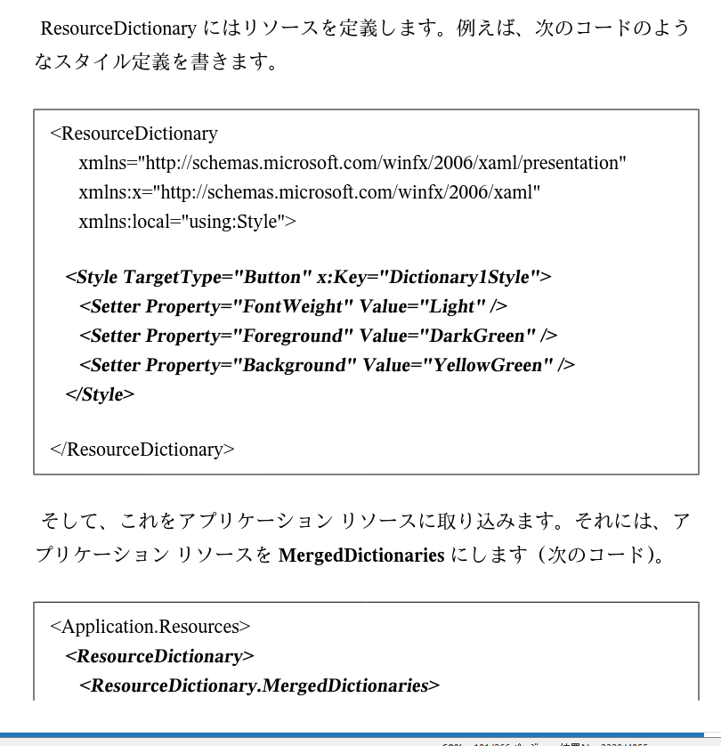

# スタイル定義とリソース定義の引用を用いた説明

## スタイル定義の説明

---

## リソース定義の説明

---

## スタイル定義の定義例

---

## コントロールのスタイル定義

---

## グループ毎のスタイル定義

## 引用文献

> r443_スタイル定義_WPFでXAMLを書く方法:ピーコックアンダーソン『C#のWPFでXAMLを書く方法』Kindle版、2019年  
> r443_名前空間_XAMLによるUWPアプリ開発入門: UWP アプリ開発 101 第2版: Windows Forms 開発者のための C# / XAML による UWP アプリ開発入門 (Kindle版),2017,BluewaterSoft,山本 康彦  
> Héctor Uriel Pérez「.NET MAUI course with Visual Studio 2022 creating PROJECTS」、udemy、2024年  
