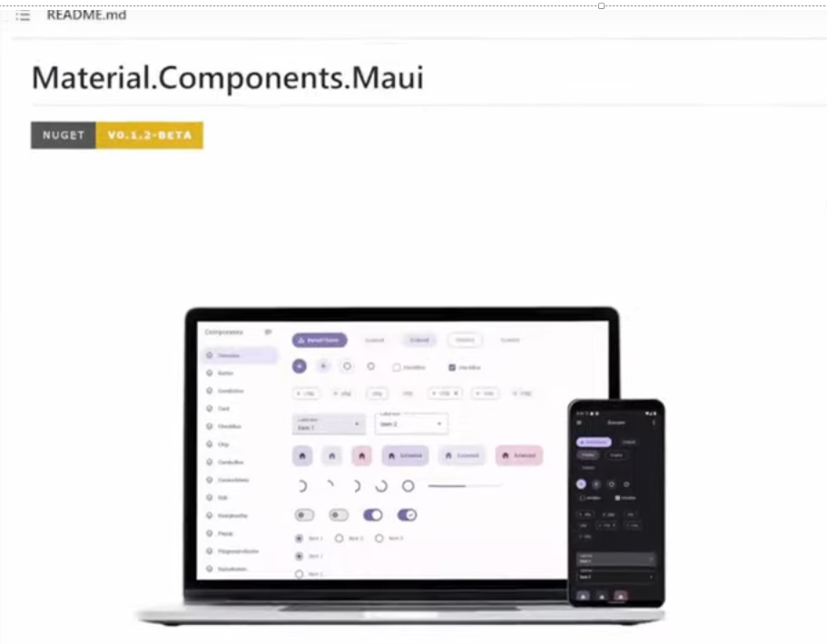

# レスポンシブとマテリアルデザイン

## レスポンシブデザイン

- [レスポンシブ デザインの手法(Microsoft公式)](https://learn.microsoft.com/ja-jp/windows/apps/design/layout/responsive-design)
- [XAML でのレスポンシブ レイアウト(Microsoft公式)](https://learn.microsoft.com/ja-jp/windows/apps/design/layout/layouts-with-xaml)
- [ResponsiveFlyoutin.NETMAUI](https://dev.to/vhugogarcia/responsive-flyout-in-net-maui-4ll1)
- [ResponsiveLayoutsforPortraitandLandscapeModes](https://blog.ewers-peters.de/add-responsive-layouts-to-your-maui-app)
- [ResponsiveUI](https://www.youtube.com/watch?v=H6RZZlgyqMA)

---

## MAUIのマテリアルデザインサンプル

### VisualStateManager

- [ラジオボタンの見た目をかえる](https://alan-code.com/howto-change-radiobutton-show/)
