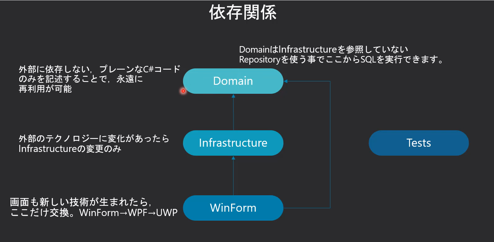
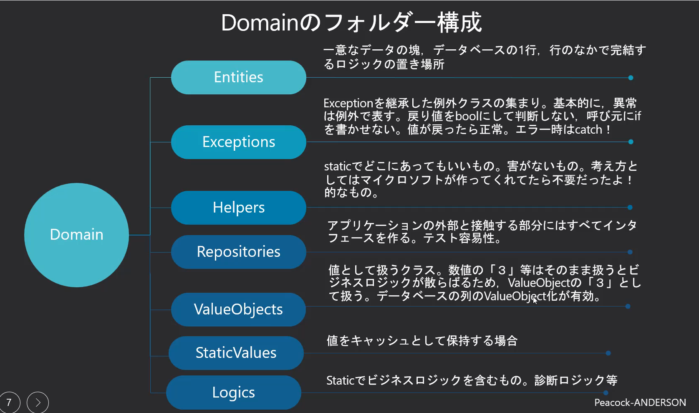
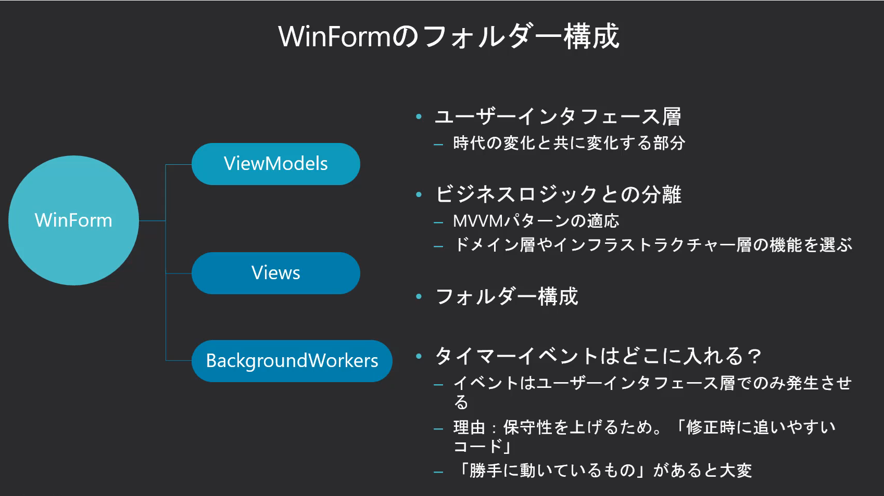

# .NET MAUIとC#の共通ルール

- [名前付けのガイドライン(Microsoft公式)](https://learn.microsoft.com/ja-jp/dotnet/standard/design-guidelines/naming-guidelines)

---

## プロジェクト構成

### フォルダー構成

**開発コードのフォルダー構成は以下の概念を採用(ドメイン駆動開発の例を参考とする)。**

## コーディング規約

### 目的

- [コーディング規約の目的](https://www.geekly.co.jp/column/cat-preparation/purpose-of-coding-conventions/)

### 基本方針

- [一般的なC#のコード規則](https://learn.microsoft.com/ja-jp/dotnet/csharp/fundamentals/coding-style/coding-conventions)

### コーディングルールチェックの導入

 静的解析ツールの**スタイルコップアナライザを採用**

## 共通命名規則

### 目的

> [!IMPORTANT]  
> **人が変わるとわからないを防ぐ。百人いれば百通りの作り方がある。**  
> **誰が作成しても一定以上の品質を確保する。**  

- [命名規則による時間と労略の削減](https://b-risk.jp/blog/2022/09/naming/)

### 基本方針

- [C#識別子の名前付け規則と表記規則(Microsoft公式)](https://learn.microsoft.com/ja-jp/dotnet/csharp/fundamentals/coding-style/identifier-names)
- [C#全般の命名規則1](https://water2litter.net/rye/post/c_naming/)
- [日本人エンジニア必携_英語命名規則の決定版](https://qiita.com/hironori_narita/items/4b06db0953053d41c4a0)

### コントロール名

- [コントロール命名規則](https://yaju.sakura.ne.jp/wiki/doku.php?id=it%E6%8A%80%E8%A1%93:%E3%82%B7%E3%82%B9%E3%83%86%E3%83%A0%E9%96%8B%E7%99%BA:%E3%82%B3%E3%83%BC%E3%83%87%E3%82%A3%E3%83%B3%E3%82%B0%E8%A6%8F%E7%B4%84)
- [コントロール名 命名規則](https://itnotebookorigin.blogspot.com/2014/10/blog-post_29.html)
- [パラメーターに名前を付ける](https://learn.microsoft.com/ja-jp/dotnet/standard/design-guidelines/naming-parameters)

### リソース名

- [リソース名](https://learn.microsoft.com/ja-jp/dotnet/standard/design-guidelines/naming-resources)

### データベース

> [!IMPORTANT]  
> **列名：DBで最も使用頻度の高いスネークケースを採用。**  
> **ChatGPTでもスネークケースを認識してくれるため、自動化、省力化、品質向上全てに寄与できる。**  

- [命名規則_キャメルケース_スネークケース_ケバブケースについて](https://designsupply-web.com/media/development/4052/)
- [オブジェクト命名規則GitHub](https://github.com/it2911/tidb_database_develop_manual/blob/main/2.%20%E3%82%AA%E3%83%96%E3%82%B8%E3%82%A7%E3%82%AF%E3%83%88%E5%91%BD%E5%90%8D%E8%A6%8F%E5%89%87.md)
- [データベース設計で絶対役に立つ命名規則](https://www.katalog.tokyo/?p=5403)

## 独自命名規約

### 統一用語は前、個別の名前は後付け

例：コントロールの命名規則など。

#### 目的

- 検索や入力を効率化するため
  - 正規表現を用いた検索などに活用が可能。
  - Visual Studioのコードビハインドを使い、一覧から選択できるようにする

### クラス内部の命名規則

- フィールド名は先頭を_とする
- 引数、ローカル変数はキャメルケース

### データベース

#### テーブル命名規則

> [!NOTE]
> **テーブル名：世の中の標準の命名規則を参考にしながらも、簡便さを優先する**
> **結論：テーブル名にプレフィックスはつけないが、仕様書の定義としては、マスタ、トランザクション、ビューの区別をつける**

#### テーブル名の命名規則参考

- [テーブル名にプレフィックスをつけるのは日本のSIer独自文化ですか？](https://www.gixo.jp/blog/12383/)
- [テーブル命名規約と項目命名規約をつくる | データ分析のお作法](https://www.gixo.jp/blog/12383/)

## チェック項目リスト

### 詳細設計

#### 開発環境

- [x] フォルダー構成
- [x] デバッグ構成
- [x] 設定ファイルの読み書き(iniファイルの代案と項目の設定)
- [x] ON,OFF設定（メニューバーのON,OFF　AppShellを呼び出すか、直接メインページを呼び出すか等）

#### コントロールイベント

- [x]ボタンイベントはXamlで定義せず、プログラムで作成するように1か所に分ける。(画面とコードの処理を分離させる)
- [x] ユーザーコントロール
- [x] クリックイベントの一括登録(コードでの実現）
- [x] 入力規則の反映

#### 静的解析

- [x] 構文ルール自動チェック
- [x] スタイルコップアナライザの適用

#### 画面設計品質の確保

- []単体テストでスタイル定義を変更させ、各画面がスタイル定義により自動的にスタイル変更されていること

## 引用文献

> [udemy_C#でドメイン駆動開発パート2](https://www.udemy.com/course/domain-2/?couponCode=JPLETSLEARNNOW)
