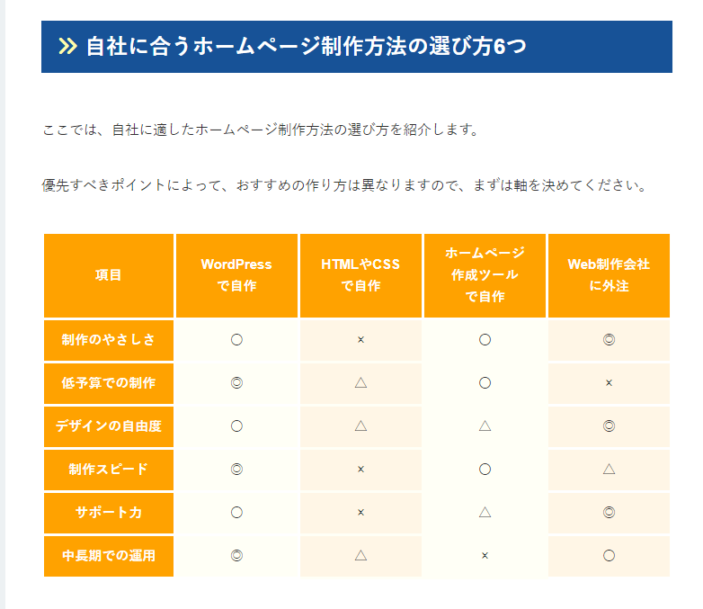

# WordPress採用までのホームページ選定検討まとめ

> [!IMPORTANT]  
> **ホームページ制作手段としてWordPressを採用**

## ホームページの作成方法の種類

- [ホームページの作り方](https://www.xserver.ne.jp/bizhp/how-to-make-a-homepage/)

上記のページでは以下4種類を紹介

- WordPressで自作
- HTMLやCSSで自作
- ホームページ作成ツールで自作
- Web制作会社に外注

下記でも4つの作成方法を紹介

- [ホームページ作成方法のパターン](https://www.tol.jp/advice/website_how_to_make/)

### 比較した評価結果

### 比較結果

| 方法                   | 特徴                                                               | メリット                                              | デメリット                                       |
|----------------------|-------------------------------------------------------------------|-----------------------------------------------------|-----------------------------------------------|
| ウェブサイトビルダー   | ドラッグ＆ドロップのインターフェイスを提供。プログラミング不要。                      | 初心者でも簡単に使用可能。時間とコストを節約できる。       | カスタマイズの自由度が限られる。利用料金がかかる場合がある。 |
| コンテンツ管理システム (CMS) | WordPressなど、テーマやプラグインで簡単に機能拡張可能。                              | 高いカスタマイズ性。多機能。                              | 初期設定や維持に技術的な知識が必要。                       |
| 自分でコーディング     | HTML、CSS、JavaScriptなどを使用して一からウェブサイトを構築。                         | 完全なカスタマイズが可能。                                 | 高い技術力が必要。時間がかかる。                           |

## WordPress基礎

- [WordPressのシェアは何%](https://blog-bootcamp.jp/start/wordpress-share/)
- [WordPress習得に必要な学習時間](https://miimumlog.com/wordpress-300hour/)

## 引用文献

> ChatGPT
