# WordPressのメリット

## 概要

ホームページを作成するためのコンテンツ管理システム(CMS)の1つ。  

## HPでWordPressを使うメリット

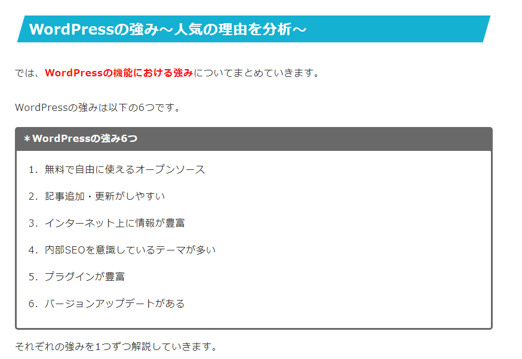

### シェア率世界1位で事実上のデファクトスタンダード

- [WordPressのシェアは何%](https://blog-bootcamp.jp/start/wordpress-share/)

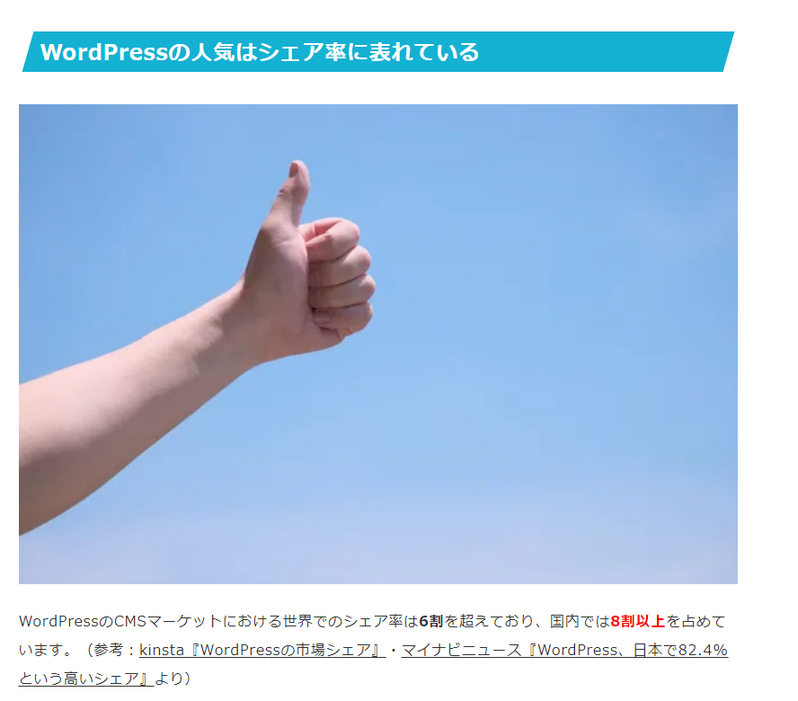

### 無料のため低予算での開発が可能

WordPressはオープンソースのため、無料で利用できます。WordPressを設置するサーバーやドメインの費用が必要にはなりますが、相場は月1000円程度で収まります。  

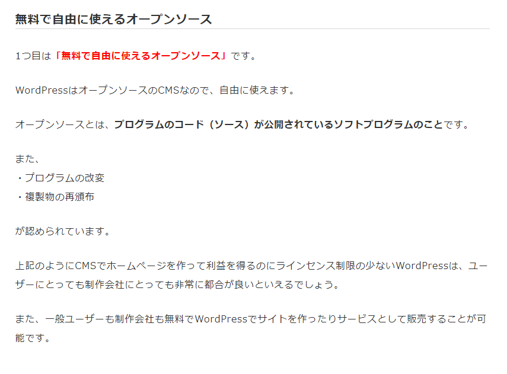

### WEB制作のスキルがなくてもサイト作成が可能

WordPressの編集機能「ブロックエディター」を使えばプログラミング言語が使えない方でも、HP制作ができます。  
ブロックエディターとは、文章や画像などを「ブロック」という単位で管理していくエディターで、HTMLやCSSなどの知識がなくとも直感的な操作で執筆できます。  

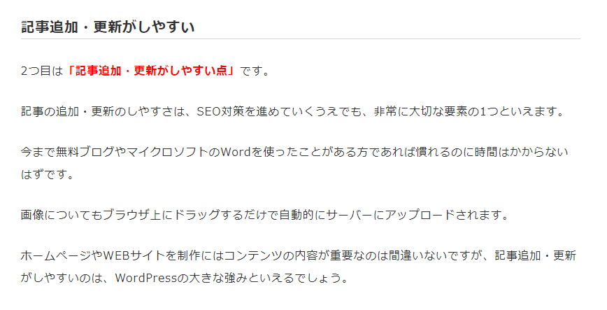
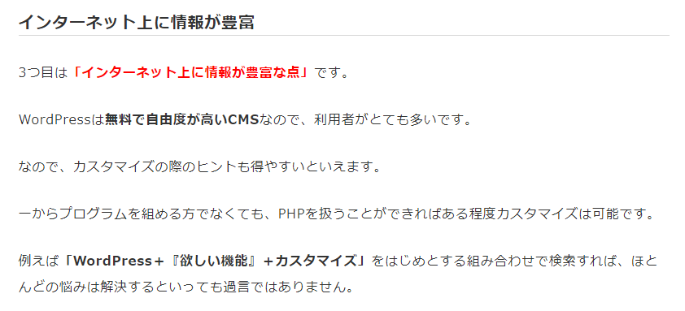

### HPのデザインやレイアウトが決まったテーマが豊富

WordPressには、サイトのデザインやレイアウトが、すでに設計した「テーマ」というテンプレートが豊富にあります。  
2023年6月時点で10,960個もの無料テーマがあります。

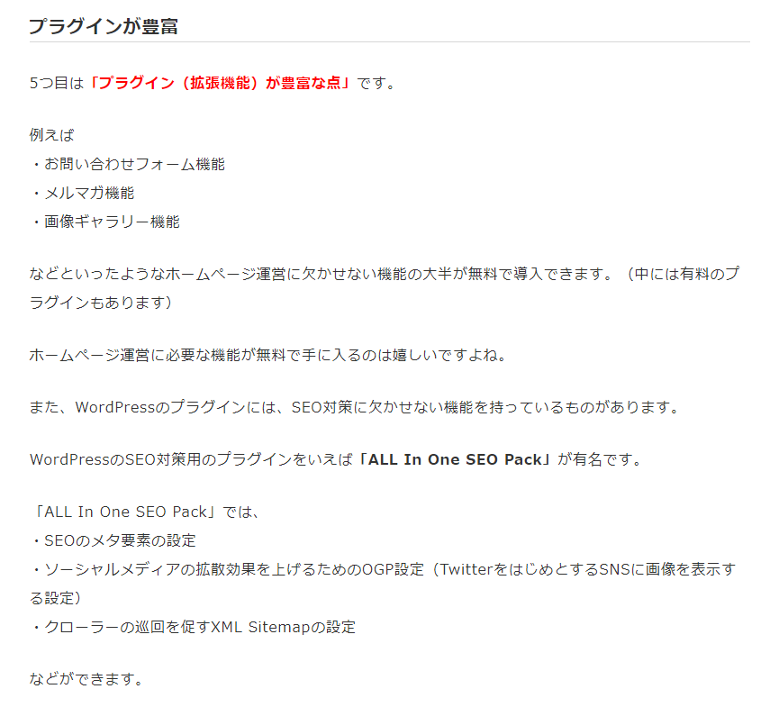
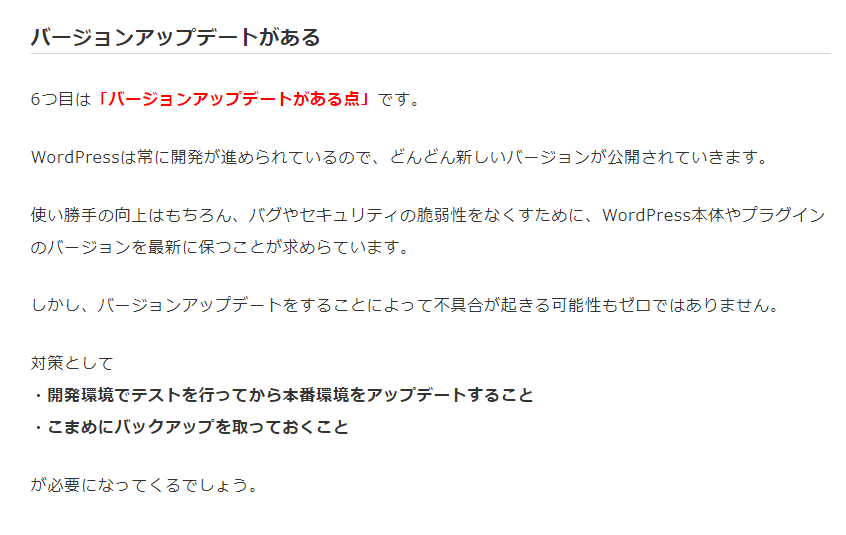

### SEOを考慮した設計が施されている

WordPressのプラグインにはSEO対策に関わるものも多く、内部SEO対策が備わっています。  

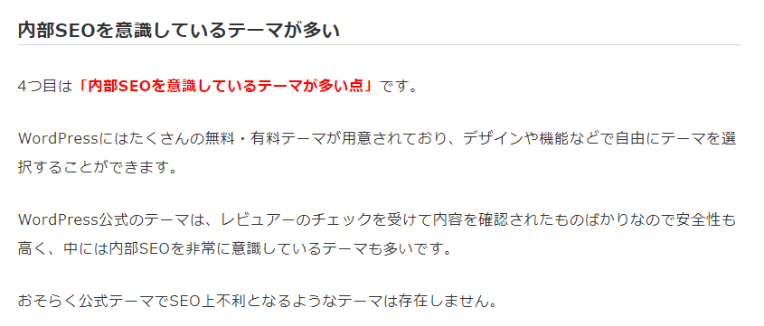

### その他

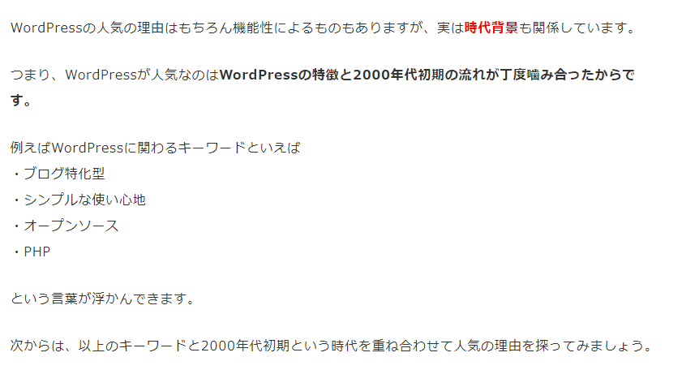
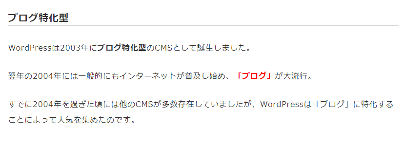
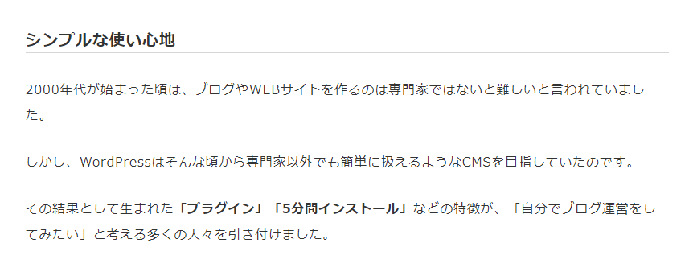
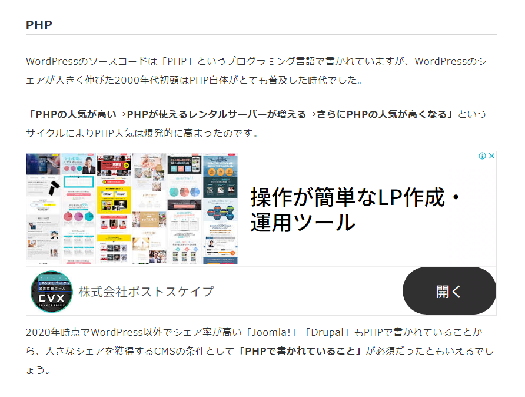

## WordPressを用いたホームページの作り方

- [8つの作成手順を解説](https://www.webdeki.com/column/9845/)

## 参考情報

- [WordPressが会社のホームページ制作に適している理由](https://www.xserver.ne.jp/bizhp/why-wordpress-is-suitable/#%E4%B8%96%E7%95%8C%E3%82%B7%E3%82%A7%E3%82%A21%E4%BD%8D)

## 引用文献

> ※8：[なぜ日本でWordPressのシェア率・人気がこれほどまでに高いのか？](https://www.1st-net.jp/blog/wordpress-popular-reason/)
